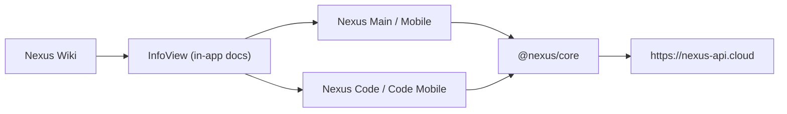

# Nexus Ecosystem

Nexus ist ein Multi-App Workspace-System fuer Planung, Entwicklung und Daily Operations.
Dieses Repository enthaelt die produktiven Clients, den Shared Core und die Wiki-Dokumentation.

## Produktueberblick

Nexus besteht aus vier Client-Apps:

- `Nexus Main` (Desktop, Electron)
- `Nexus Mobile` (Mobile, Capacitor)
- `Nexus Code` (Desktop IDE, Electron)
- `Nexus Code Mobile` (Mobile IDE, Capacitor)

Zentrale Ziele:

- schnelle Bedienung trotz umfangreicher Features
- konsistente UX zwischen Desktop und Mobile
- klare Architekturgrenzen zwischen App-Layer, Shared Core und API

## Architektur



## Render Pipeline und Motion Engine

Die Clients nutzen eine zentrale Render-/Motion-Infrastruktur aus `@nexus/core`:

- Render Pipeline:
  `Measure -> Resolve -> Allocate -> Commit -> Cleanup`
- Surface-/Effect-Model:
  `surfaceClass`, `effectClass`, `budgetPriority`, `visibilityState`, `interactionState`
- Motion Capabilities:
  `full`, `rich-reduced`, `composed-light`, `critical-only`, `static-safe`
- Ownership Guardrails:
  kein ungeplanter Konflikt bei `transform`, `filter`, `opacity`

Dadurch bleiben Animationen hochwertig, aber unter Last kontrolliert degradierbar.

## Core Views (Main/Mobile)

- `dashboard`: Today-Layer, Capture, Resume, Workspace-Kontext
- `notes`: Markdown, Magic-Elemente, Split/Edit/Preview
- `tasks`: Kanban + Prioritaet/Deadline
- `reminders`: Due/Overdue/Snooze + Control Center
- `canvas`: Nodes/Templates/Auto-Layout
- `files`: Workspace- und Handoff-Flows
- `flux`: Ops-/Queue-Flow
- `devtools`: produktive UI/Builder-Utilities
- `settings`: Presets + Material/Motion/Theme
- `info`: In-App Product-Brain + Architektur + Diagnostics

## Dokumentationslandkarte

- `README.md` (dieses Dokument): Repo- und Architektur-Einstieg
- `Nexus Main/README.md`: Desktop-App-Details
- `Nexus Mobile/README.md`: Mobile-App-Details
- `Nexus Code/README.md`: Desktop-IDE-Details
- `Nexus Code Mobile/README.md`: Mobile-IDE-Details
- `packages/nexus-core/README.md`: Shared Render/Motion/API-Contracts
- `Nexus Wiki/README.md`: Wiki/GitHub-Pages Hub
- `nexusproject.dev/README.md`: Website/Pricing/API-Policy Doku

## Setup

```bash
git clone https://github.com/YoungJibbit95/Nexus-Ecosystem.git
cd Nexus-Ecosystem
npm run setup
```

## Development

```bash
npm run dev:all
npm run dev:all:with-control-ui
npm run dev:main
npm run dev:code
npm run dev:mobile:android
npm run dev:code-mobile:android
```

## Build und Verifikation

```bash
npm run build:ecosystem
npm run verify:single-react
npm run verify:ecosystem
npm run doctor:release
```

## Aktuelle Stabilisierung (Release-Pass)

- Canvas-Interaktion wurde fuer Main und Mobile stabilisiert:
  Node-Scroll bleibt lokal in der Node, Trackpad-Gesten ueber Nodes triggern den Canvas nicht mehr, und Editor-Caret-Jumps beim Tippen wurden durch Draft+Debounce-Commit reduziert.
- API->Client View-Access wurde robust gemacht:
  User-Kontext nutzt jetzt zusaetzlich Website-Session-, Payment-Status- und Subscription-Flags fuer konsistente Tier-Erkennung (`free`/`paid`) in Main, Mobile, Code und Code Mobile.
- Build/Runtime-Hardening:
  `@nexus/core` Alias ist in allen Apps konsistent hinterlegt, damit Build und Runtime dieselbe Core-Aufloesung nutzen.

## Environment

Produktiver API-Host fuer Clients:

- `VITE_NEXUS_CONTROL_URL=https://nexus-api.cloud`
- `VITE_NEXUS_CONTROL_INGEST_KEY=<pro app key>`

Optional:

- `VITE_NEXUS_USER_ID`
- `VITE_NEXUS_USERNAME`
- `VITE_NEXUS_USER_TIER`

## Security Boundary

Dieses Repository enthaelt keine private API-Server-Implementierung.

- im Repo: Clients, Shared Core, Wiki, Tooling
- ausserhalb: API-Server, Infrastruktur, Secrets
