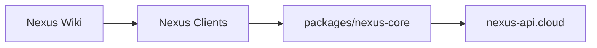

# Nexus Ecosystem

Nexus ist ein Multi-App Workspace-Produkt. Das Repository enthaelt die vier Client-Apps (Desktop + Mobile), den gemeinsamen Core/API-Client und die Wiki-Doku.

- Produkt-Wiki: https://youngjibbit95.github.io/Nexus-Ecosystem
- API-Ziel fuer Clients: `https://nexus-api.cloud`

## Was Nexus ist

Nexus kombiniert produktive Arbeitsflaechen in einem einheitlichen System:

- Planen: Dashboard, Tasks, Reminders, Canvas
- Dokumentieren: Notes mit Magic-Elementen
- Entwickeln: Nexus Code / Nexus Code Mobile
- Dateiarbeit: Files + Workspace-Ordner-Flows
- Steuerung: Command Palette, Terminal, Spotlight, Quick Actions

Die Apps teilen sich denselben Runtime-/Control-Client (`packages/nexus-core`) und ein konsistentes Theme-/UX-System.

## Apps im Repository

- `Nexus Main` (Electron): Haupt-Desktop-App
- `Nexus Mobile` (Capacitor): Mobile Haupt-App
- `Nexus Code` (Electron): Developer-/IDE-App
- `Nexus Code Mobile` (Capacitor): Mobile Code-App
- `packages/nexus-core`: Shared Runtime, API-Client, Sync-/Validation-Logik
- `Nexus Wiki`: Doku fuer GitHub Pages

## Feature- und View-Ueberblick

### Nexus Main / Nexus Mobile

- `dashboard`: Live-Ueberblick, Widgets, Status
- `notes`: strukturierte Notizen, Magic-Elemente, Markdown
- `tasks`: Kanban-/Todo-Workflows
- `reminders`: Termine, Snooze, Overdue-Handling
- `canvas`: visuelle Planung, Projekt-/Mindmap-Strukturen
- `files`: dateibasierte Workflows und Workspace-Zuordnung
- `devtools`: interne Builder-/Hilfsfunktionen
- `flux`: experimentelle/erweiterte Workflows
- `settings`: Theme, Rendering, UX/QoL
- `info`: Hilfe, Commands, Produktinfos

### Nexus Code / Nexus Code Mobile

- Editor, File-Tree, Tabs, Search, Git-/Debug-/Problems-Panels
- Terminal-Integration und Workspace-Dateizugriffe
- gleiches Theme-/Panel-System wie Nexus Main (mit Code-Fokus)

## Architektur (High-Level)



Hinweis: Die eigentliche Server-API liegt ausserhalb dieses Repos.

## Schnellstart

```bash
git clone https://github.com/YoungJibbit95/Nexus-Ecosystem.git
cd Nexus-Ecosystem
npm run setup
```

## Entwicklung

```bash
# Main + Code
npm run dev:all

# optional mit Control UI
npm run dev:all:with-control-ui

# einzelne Apps
npm run dev:main
npm run dev:code
npm run dev:mobile:android
npm run dev:code-mobile:android
```

## Build und Verifikation

```bash
npm run build:ecosystem
npm run verify:ecosystem
npm run doctor:release
```

## Environment (ohne Secrets)

Alle Apps nutzen denselben Host:

- `VITE_NEXUS_CONTROL_URL=https://nexus-api.cloud`
- `VITE_NEXUS_CONTROL_INGEST_KEY=<pro-app key>`
- optional: `VITE_NEXUS_USER_ID`, `VITE_NEXUS_USERNAME`, `VITE_NEXUS_USER_TIER`

## Repo-Grenzen

Dieses Repo enthaelt **keine private Server-Implementierung** der API.

- im Repo: Clients, Shared Core, Build/Tooling, Wiki
- ausserhalb: API-Server-Repo + Infrastruktur
