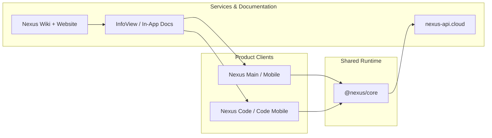

<a id="top"></a>

<div align="center">


<p>
  <a href="https://github.com/YoungJibbit95/Nexus-Ecosystem/stargazers"></a>
  <a href="https://github.com/YoungJibbit95/Nexus-Ecosystem/network/members"></a>
  <a href="https://github.com/YoungJibbit95/Nexus-Ecosystem/issues"></a>
  <a href="https://github.com/YoungJibbit95/Nexus-Ecosystem/pulls"></a>
</p>

<p>
  
  
  
  
  
  
</p>

<p>
  
  
  
  
  
  
</p>

<a href="https://nexusproject.dev"></a>
<a href="https://youngjibbit95.github.io/Nexus-Ecosystem/"></a>

<br /><br />


<br />

<a href="#overview">Overview</a>
&nbsp;&nbsp;•&nbsp;&nbsp;
<a href="#quick-links">Quick Links</a>
&nbsp;&nbsp;•&nbsp;&nbsp;
<a href="#product-surface">Products</a>
&nbsp;&nbsp;•&nbsp;&nbsp;
<a href="#architecture">Architecture</a>
&nbsp;&nbsp;•&nbsp;&nbsp;
<a href="#getting-started">Getting Started</a>
&nbsp;&nbsp;•&nbsp;&nbsp;
<a href="#security-status">Security</a>

</div>

---

<a id="overview"></a>

<div align="center">

## 🌌 Overview

</div>

> [!IMPORTANT]
> Nexus ist ein Multi-App Workspace-System für Planung, Entwicklung und Daily Operations.  
> Dieses Repository enthaelt die produktiven Clients, Shared Core Runtime-Logik und die Wiki-/Website-Dokumentation.

<div align="center">

<table>
<tr>
<td align="center"><b>4</b><br /><sub>Product Clients</sub></td>
<td align="center"><b>2</b><br /><sub>Target Families</sub></td>
<td align="center"><b>1</b><br /><sub>Shared Core</sub></td>
<td align="center"><b>Cross-Device</b><br /><sub>Workspace Model</sub></td>
</tr>
</table>

<br />

<a href="https://github.com/YoungJibbit95/Nexus-Ecosystem">
  
</a>

</div>

---

<div align="center">

## 📡 Development Pulse

<sub>Repository activity and maintainer development overview</sub>

<br /><br />

<picture>
  <source media="(prefers-color-scheme: dark)" srcset="https://github-readme-stats.vercel.app/api?username=YoungJibbit95&show_icons=true&theme=tokyonight&hide_border=true&border_radius=14&include_all_commits=true&rank_icon=github" />
  <source media="(prefers-color-scheme: light)" srcset="https://github-readme-stats.vercel.app/api?username=YoungJibbit95&show_icons=true&theme=default&hide_border=true&border_radius=14&include_all_commits=true&rank_icon=github" />
  
</picture>

<picture>
  <source media="(prefers-color-scheme: dark)" srcset="https://streak-stats.demolab.com?user=YoungJibbit95&theme=tokyonight&hide_border=true&border_radius=14" />
  <source media="(prefers-color-scheme: light)" srcset="https://streak-stats.demolab.com?user=YoungJibbit95&theme=default&hide_border=true&border_radius=14" />
  
</picture>

<br /><br />


<br />


<br />


</div>

---

<a id="quick-links"></a>

<div align="center">

## 🚀 Quick Links

</div>

<table align="center">
<tr>
<td align="center" width="50%">

### 🧠 Workspace

| Surface | Link |
| --- | --- |
| Nexus Main README | [Open](./Nexus%20Main/README.md) |
| Nexus Mobile README | [Open](./Nexus%20Mobile/README.md) |
| @nexus/core README | [Open](./packages/nexus-core/README.md) |

</td>
<td align="center" width="50%">

### 💻 Development

| Surface | Link |
| --- | --- |
| Nexus Code README | [Open](./Nexus%20Code/README.md) |
| Nexus Code Mobile README | [Open](./Nexus%20Code%20Mobile/README.md) |
| Nexus Native Installer README | [Open](./Nexus%20Installer/README.md) |

</td>
</tr>
</table>

<div align="center">

| Docs | Link |
| --- | --- |
| 📚 Nexus Wiki | [Visit](https://youngjibbit95.github.io/Nexus-Ecosystem/) |
| 🌍 nexusproject.dev | [Visit](https://nexusproject.dev) |

</div>

---

<a id="product-surface"></a>

<div align="center">

## 🧱 Product Surface

</div>

| App | Platform | Primary Scope | Stack |
| --- | --- | --- | --- |
| `Nexus Main` | Desktop | planning, notes, tasks, canvas, workspace | Electron + React + Vite |
| `Nexus Mobile` | Android/iOS | mobile parity for core workspace flows | Capacitor + React + Vite |
| `Nexus Code` | Desktop IDE | editor, run/debug, terminal, project workflow | Electron + React + Vite |
| `Nexus Code Mobile` | Android/iOS IDE | mobile coding and project ops | Capacitor + React + Vite |

<div align="center">

<br />


</div>

---

<div align="center">

## 🧠 Core View Matrix (Main/Mobile)

</div>

| View | Primary Job | Key Capabilities |
| --- | --- | --- |
| `dashboard` | command center | Today layer, resume lane, quick capture, workspace context, engine health |
| `notes` | knowledge and docs | markdown editor, preview/reading mode, templates, backlinks and linking helpers |
| `tasks` | execution | kanban lanes, focus lane, priorities/deadlines, batch actions |
| `reminders` | scheduling | due/overdue grouping, snooze/completion, health/control center |
| `canvas` | visual planning | node graph, templates/magic, auto-layout, inspector, keyboard/pointer flows |
| `files` | workspace and handoff | workspace folders, import/export handoff, status and history surfaces |
| `flux` | ops and throughput | queue/signal view, action routing, bottleneck support |
| `code` | embedded coding view | fast edit/run path integrated in Main/Mobile shell |
| `devtools` | internal tooling | diagnostics, recipe/testing surfaces, development helpers |
| `settings` | system controls | appearance, typography, panel behavior, motion/render controls |
| `info` | in-app docs | architecture, diagnostics explanation, view guides and release notes |

---

<a id="architecture"></a>

<div align="center">

## 🏗️ Architecture

</div>



<div align="center">


</div>

---

<div align="center">

## 🎞️ Render and Motion Pipeline

</div>

> [!NOTE]
> All clients are aligned to the shared runtime model in `@nexus/core`.

### Render pipeline phases

```txt
Measure -> Resolve -> Allocate -> Commit -> Cleanup
```

### Surface/effect resolution

```txt
surfaceClass
effectClass
budgetPriority
visibilityState
interactionState
```

### Motion capability/degradation

```txt
full
rich-reduced
composed-light
critical-only
static-safe
```

### Guardrails

> `transform`, `filter`, and `opacity` ownership is centrally coordinated to prevent conflicts.

This keeps UX smooth while still degrading safely under low power, reduced motion, or lag pressure.

---

<div align="center">

## 🗂️ Repository Map

</div>

| Area | Purpose |
| --- | --- |
| `Nexus Main/` | desktop workspace app |
| `Nexus Mobile/` | mobile workspace app |
| `Nexus Code/` | desktop IDE app |
| `Nexus Code Mobile/` | mobile IDE app |
| `Nexus Installer/` | native Rust installer for build+install from GitHub |
| `packages/nexus-core/` | shared render/motion/runtime contracts |
| `packages/nexus-api/` | shared API clients/contracts |
| `tools/` | verify/release guard scripts |
| `Nexus Wiki/` | wiki site source |
| `nexusproject.dev/` | website source |

---

<a id="getting-started"></a>

<div align="center">

## ⚡ Getting Started

</div>

```bash
git clone https://github.com/YoungJibbit95/Nexus-Ecosystem.git
cd Nexus-Ecosystem
npm run setup
```

---

<div align="center">

## 🛠️ Development

</div>

```bash
npm run dev:all
npm run dev:all:with-control-ui
npm run dev:main
npm run dev:mobile:web
npm run dev:code
npm run dev:code-mobile:web
```

---

<div align="center">

## 📦 Build and Verify

</div>

```bash
npm run build:ecosystem
npm run verify:single-react
npm run verify:ecosystem
npm run doctor:release
```

<div align="center">


</div>

---

<div align="center">

## 📚 Dependency Baseline (April 2026)

</div>

> Major dependency refresh is applied across all 4 apps and validated with full builds plus verify scripts.

| Dependency | Version |
| --- | --- |
| React / React DOM | `19.2.x` |
| Framer Motion | `12.38.x` |
| Lucide React | `1.8.x` |
| Monaco Editor | `0.55.x` |
| Three.js | `0.184.x` |
| Zustand | `5.0.x` |
| React Markdown | `10.1.x` |

---

<a id="security-status"></a>

<div align="center">

## 🔐 Security Status

</div>

> [!TIP]
> Security checks for high-severity production dependencies currently report `0 vulnerabilities` across all four product clients.

- `Nexus Main`
- `Nexus Mobile`
- `Nexus Code`
- `Nexus Code Mobile`

<div align="center">


</div>

---

<div align="center">

## 🌍 Environment

</div>

### Production API host

```env
VITE_NEXUS_CONTROL_URL=https://nexus-api.cloud
VITE_NEXUS_CONTROL_INGEST_KEY=<per-app key>
```

### Optional overrides

```env
VITE_NEXUS_USER_ID
VITE_NEXUS_USERNAME
VITE_NEXUS_USER_TIER
```

---

<div align="center">

## 🛡️ Security Boundary

</div>

> [!CAUTION]
> This repository does not include the private backend implementation or private secrets.

| Included in repo | Excluded from repo |
| --- | --- |
| clients | backend services |
| shared core | infrastructure |
| wiki | private secrets |
| web/docs | — |

---

<details>
<summary><b>✨ Ecosystem Summary</b></summary>

<br />

```txt
Nexus Main        -> Workspace System
Nexus Mobile      -> Mobile Workspace
Nexus Code        -> Desktop IDE
Nexus Code Mobile -> Mobile IDE
@nexus/core       -> Shared Runtime + Motion Pipeline
```

</details>

<details>
<summary><b>🧩 Platform Matrix</b></summary>

<br />

| Capability | Desktop | Mobile | Shared Core |
| --- | :---: | :---: | :---: |
| Workspace planning | ✅ | ✅ | ✅ |
| Notes and tasks | ✅ | ✅ | ✅ |
| IDE workflow | ✅ | ✅ | ✅ |
| Runtime contracts | ✅ | ✅ | ✅ |
| Native installer | ✅ | — | — |

</details>

---

<div align="center">

## ✨ Nexus Ecosystem

### Unified Workspace Infrastructure

<p>
  
  
  
  
</p>

<a href="https://github.com/YoungJibbit95/Nexus-Ecosystem"></a>
<a href="#top"></a>


</div>
