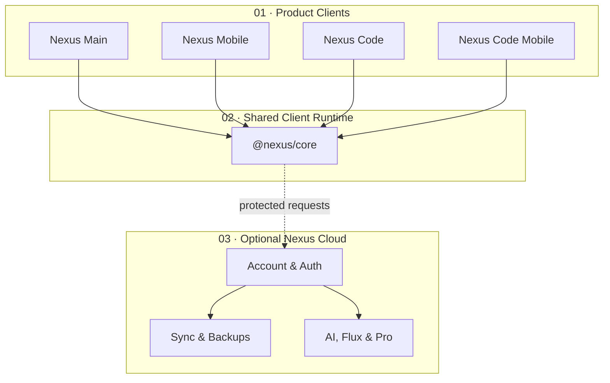

<a id="top"></a>

<div align="center">


### Local-first Open-Core Workspace for Planning, Writing & Development

<p>
  <a href="https://nexusproject.dev"></a>
  <a href="https://youngjibbit95.github.io/Nexus-Ecosystem/"></a>
  <a href="https://github.com/YoungJibbit95/Nexus-Ecosystem/releases"></a>
</p>

<p>
  <a href="https://github.com/YoungJibbit95/Nexus-Ecosystem/actions/workflows/release-gate.yml"></a>
  <a href="https://github.com/YoungJibbit95/Nexus-Ecosystem/actions/workflows/security-verify.yml"></a>
  <a href="https://github.com/YoungJibbit95/Nexus-Ecosystem/actions/workflows/codeql.yml"></a>
</p>

<p>
  
  
  
  
  
</p>

<a href="#overview">Overview</a>
&nbsp;&nbsp;•&nbsp;&nbsp;
<a href="#ecosystem">Ecosystem</a>
&nbsp;&nbsp;•&nbsp;&nbsp;
<a href="#architecture">Architecture</a>
&nbsp;&nbsp;•&nbsp;&nbsp;
<a href="#getting-started">Getting Started</a>
&nbsp;&nbsp;•&nbsp;&nbsp;
<a href="#security">Security</a>
&nbsp;&nbsp;•&nbsp;&nbsp;
<a href="#releases">Releases</a>
&nbsp;&nbsp;•&nbsp;&nbsp;
<a href="#development-activity">Activity</a>

</div>

---

<a id="overview"></a>

<div align="center">

## Overview

<sub>Free local tools for planning, writing and coding, with optional Nexus Cloud services.</sub>

</div>

<br />

<table>
<tr>
<td width="33%" align="center">

### 🧠 One Workspace

Notes, tasks, reminders, canvas, files and code in one connected local workspace.


</td>
<td width="33%" align="center">

### 📱 Cross-Platform

Electron and Capacitor clients provide focused desktop and mobile experiences.


</td>
<td width="33%" align="center">

### ⚙️ Shared Foundation

Runtime, rendering, motion and public client contracts stay aligned through reusable shared packages.


</td>
</tr>
</table>

> [!IMPORTANT]
> **Nexus Ecosystem** contains four public clients, a shared client runtime, release tooling and public documentation. Nexus Cloud is optional and private; account, payment, sync, AI orchestration, admin tooling, infrastructure and secrets remain outside this repository. Cloud and Pro permissions are enforced server-side.

<div align="center">

<a href="https://github.com/YoungJibbit95/Nexus-Ecosystem">
  
</a>

<br /><br />

### Repository Pulse

<sub>Live repository metadata, refreshed automatically.</sub>

<br />

<p>
  
  
  
  
  
  
</p>

<br />


<br /><br />


</div>

---

<a id="ecosystem"></a>

<div align="center">

## Ecosystem

<sub>Purpose-built clients connected by one shared technical foundation.</sub>

</div>

<br />

<table>
<tr>
<td width="50%" align="center">

### 🖥️ Nexus Main

**Desktop workspace** for planning, knowledge, tasks, canvas and daily operations.

<p>
  
  
</p>

<a href="./Nexus%20Main/README.md"></a>

</td>
<td width="50%" align="center">

### 📱 Nexus Mobile

**Mobile workspace** with core workflow parity for Android and iOS.

<p>
  
  
</p>

<a href="./Nexus%20Mobile/README.md"></a>

</td>
</tr>
<tr>
<td width="50%" align="center">

### 💻 Nexus Code

**Desktop IDE** for editing, running, debugging and project workflows.

<p>
  
  
</p>

<a href="./Nexus%20Code/README.md"></a>

</td>
<td width="50%" align="center">

### 📲 Nexus Code Mobile

**Mobile IDE** for lightweight coding and remote project operations.

<p>
  
  
</p>

<a href="./Nexus%20Code%20Mobile/README.md"></a>

</td>
</tr>
</table>

<table>
<tr>
<td width="50%" align="center">

### 🔗 `@nexus/core`

Shared runtime contracts for rendering, motion, diagnostics and synchronized client behavior.

<a href="./packages/nexus-core/README.md"></a>

</td>
<td width="50%" align="center">

### 🚀 Releases & Launcher

Installer builds and checksums are produced here; the launcher lives in its own public repository.

<a href="https://github.com/YoungJibbit95/Nexus-Launcher"></a>

</td>
</tr>
</table>

### Free Local Workspace, Optional Nexus Cloud

| Area | Free local clients | Pro / Nexus Cloud |
| --- | --- | --- |
| Workspace | Local notes, tasks, reminders, canvas and files | Cloud sync, backups and multi-device continuity |
| Code | Local editor and project workflows | Account-bound cloud features and higher usage limits |
| AI / Flux | Local UI surfaces where available | Cloud-backed AI, Flux and automation features |
| Sharing | Local export and handoff | Sharing, team workflows and account-based collaboration |
| Security | Public client guardrails | Server-side entitlement and cloud access enforcement |

> [!NOTE]
> The local clients remain useful without production cloud credentials. Client-side feature gates are user-experience hints; Nexus Cloud validates all protected access on the server.

<details>
<summary><b>Explore the Main / Mobile view matrix</b></summary>

<br />

| View | Primary Job | Key Capabilities |
| --- | --- | --- |
| `dashboard` | command center | Today layer, resume lane, quick capture, workspace context, engine health |
| `notes` | knowledge and docs | markdown editor, preview/reading mode, templates, backlinks and linking helpers |
| `tasks` | execution | kanban lanes, focus lane, priorities/deadlines, batch actions |
| `reminders` | scheduling | due/overdue grouping, snooze/completion, health/control center |
| `canvas` | visual planning | node graph, templates/magic, auto-layout, inspector, keyboard/pointer flows |
| `files` | workspace and handoff | workspace folders, import/export handoff, status and history surfaces |
| `flux` | ops and throughput | queue/signal view, action routing, bottleneck support |
| `code` | embedded coding view | fast edit/run path integrated in Main/Mobile shell |
| `devtools` | internal tooling | diagnostics, recipe/testing surfaces, development helpers |
| `settings` | system controls | appearance, typography, panel behavior, motion/render controls |
| `info` | in-app docs | architecture, diagnostics explanation, view guides and release notes |

</details>

---

<a id="architecture"></a>

<div align="center">

## Architecture

<sub>Public clients stay local-first while optional cloud capabilities cross an explicit trust boundary.</sub>

</div>

<br />

<table>
<tr>
<td width="33%" align="center">

### 01 · Client Layer

Four dedicated product clients deliver workspace and IDE experiences across desktop and mobile.


</td>
<td width="33%" align="center">

### 02 · Runtime Layer

`@nexus/core` centralizes shared behavior, rendering, motion and public API-client contracts.


</td>
<td width="33%" align="center">

### 03 · Cloud Boundary

Optional account, sync, AI and Pro services remain private and enforce access server-side.


</td>
</tr>
</table>



<div align="center">


</div>

### Render & Motion Runtime

> [!NOTE]
> Every client follows the same runtime model in `@nexus/core`, allowing visual quality to scale down safely without changing product behavior.

<div align="center">


→

→

→

→


</div>

<br />

| Runtime concern | Shared model |
| --- | --- |
| Surface resolution | `surfaceClass · effectClass · budgetPriority · visibilityState · interactionState` |
| Motion degradation | `full → rich-reduced → composed-light → critical-only → static-safe` |
| Guardrails | Central ownership of `transform`, `filter` and `opacity` |

<details>
<summary><b>Explore the repository map</b></summary>

<br />

| Area | Purpose |
| --- | --- |
| `Nexus Main/` | desktop workspace app |
| `Nexus Mobile/` | mobile workspace app |
| `Nexus Code/` | desktop IDE app |
| `Nexus Code Mobile/` | mobile IDE app |
| `packages/nexus-core/` | shared render, motion, runtime and API-client contracts |
| `tools/` | setup, verification, security and release guard scripts |
| `Nexus Wiki/` | wiki site source |
| [Nexus Launcher](https://github.com/YoungJibbit95/Nexus-Launcher) | separate launcher repository |
| [nexusproject.dev](https://github.com/YoungJibbit95/nexusproject.dev) | separate product website repository |

</details>

---

<a id="getting-started"></a>

<div align="center">

## Getting Started

</div>

```bash
git clone https://github.com/YoungJibbit95/Nexus-Ecosystem.git
cd Nexus-Ecosystem
npm run setup
```

### Development

```bash
npm run dev:all
npm run dev:main
npm run dev:mobile:web
npm run dev:code
npm run dev:code-mobile:web
```

### Build and Verify

```bash
npm run build:main
npm run build:mobile
npm run build:code
npm run build:code-mobile
npm run verify:single-react
npm run verify:ecosystem
npm run check:no-private-strings
npm run check:secrets
npm run release:gate
npm run doctor:release
```

<div align="center">


</div>

<details>
<summary><b>Development and release boundaries</b></summary>

<br />

Most public client development works without production cloud credentials. Client-side environment variables are public configuration, never secrets.

- Environment setup: [docs/ENVIRONMENT.md](./docs/ENVIRONMENT.md)
- Release process: [docs/RELEASES.md](./docs/RELEASES.md)
- Versioning: [docs/VERSIONING.md](./docs/VERSIONING.md)
- Public/private boundary: [docs/PUBLIC_PRIVATE_BOUNDARY.md](./docs/PUBLIC_PRIVATE_BOUNDARY.md)

</details>

---

<a id="security"></a>

<div align="center">

## Security & Environment

</div>

> [!TIP]
> Security, CodeQL, public-surface and release checks run continuously in GitHub Actions. Use the live workflow badges above for current status instead of a hard-coded vulnerability count.

<div align="center">


</div>

Nexus desktop clients use Electron guardrails such as context isolation, disabled Node integration in renderers, preload allowlists and workspace-bound file access. Mobile clients keep native Capacitor capabilities explicit.

Client configuration is public by definition. Never place passwords, tokens, private keys or production credentials in `VITE_*` variables or this repository. See [docs/ENVIRONMENT.md](./docs/ENVIRONMENT.md) and [docs/SECURITY_MODEL.md](./docs/SECURITY_MODEL.md).

### Security Boundary

> [!CAUTION]
> This repository does not include Nexus Cloud backend implementation, account/auth internals, payment logic, sync storage, AI orchestration, admin tooling, deployment infrastructure or private secrets.

| Public in this repository | Private outside this repository |
| --- | --- |
| Nexus Main, Mobile, Code and Code Mobile | Nexus Cloud backend and infrastructure |
| Shared client runtime and API-client contracts | Account, auth, payment and entitlement internals |
| Local-first workspace behavior | Cloud sync, backups and storage |
| UI, docs, tests and release tooling | AI/Flux orchestration and admin/control tooling |
| Client-side guardrails | Secrets, signing material and abuse controls |

Read [SECURITY.md](./SECURITY.md) for private vulnerability reporting and [docs/PUBLIC_PRIVATE_BOUNDARY.md](./docs/PUBLIC_PRIVATE_BOUNDARY.md) for the full boundary.

---

<a id="releases"></a>

<div align="center">

## Releases & Contributions

<sub>Platform artifacts, checksums and public client development.</sub>

</div>

Client releases are published through [GitHub Releases](https://github.com/YoungJibbit95/Nexus-Ecosystem/releases) with platform-specific artifacts and checksums where available. Follow [docs/RELEASES.md](./docs/RELEASES.md) for release details.

Contributions are welcome for public clients, shared runtime, UI, docs, tests and release tooling. Read [CONTRIBUTING.md](./CONTRIBUTING.md) and [SUPPORT.md](./SUPPORT.md) before opening a change.

> [!NOTE]
> The final public license decision is still pending in [docs/VERSIONING.md](./docs/VERSIONING.md). Do not assume rights beyond the repository's published license state until a license file is added.

---

<a id="development-activity"></a>

<div align="center">

## Development Activity

<sub>Commit history, contribution flow and repository development overview.</sub>

<br /><br />

<picture>
  <source media="(prefers-color-scheme: dark)" srcset="https://github-readme-stats.vercel.app/api?username=YoungJibbit95&show_icons=true&theme=tokyonight&hide_border=true&border_radius=14&include_all_commits=true&rank_icon=github" />
  <source media="(prefers-color-scheme: light)" srcset="https://github-readme-stats.vercel.app/api?username=YoungJibbit95&show_icons=true&theme=tokyonight&hide_border=true&border_radius=14&include_all_commits=true&rank_icon=github" />
  
</picture>

<picture>
  <source media="(prefers-color-scheme: dark)" srcset="https://streak-stats.demolab.com?user=YoungJibbit95&theme=tokyonight&hide_border=true&border_radius=14" />
  <source media="(prefers-color-scheme: light)" srcset="https://streak-stats.demolab.com?user=YoungJibbit95&theme=tokyonight&hide_border=true&border_radius=14" />
  
</picture>

<br /><br />


<br />


</div>

---

<div align="center">

### Nexus Ecosystem

**Local-first by default. Cloud when you choose it.**

<p>
  <a href="https://github.com/YoungJibbit95/Nexus-Ecosystem"></a>
  <a href="#top"></a>
</p>


</div>
