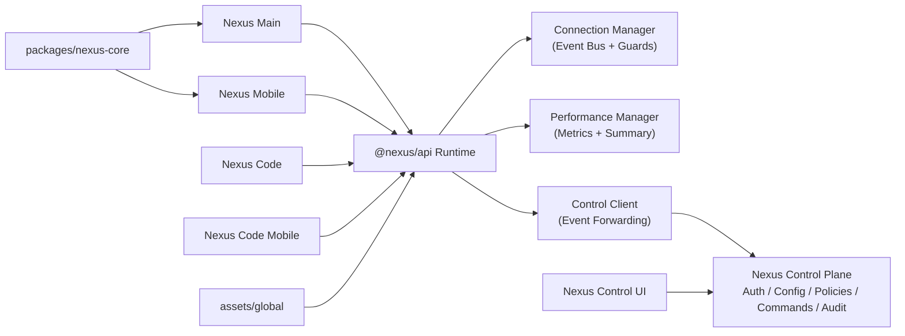

<div align="center">

# 🚀 Nexus Ecosystem

**Ein verbundenes Multi-App-System mit zentralem Control Plane und Control UI**

[](https://github.com/YoungJibbit95/Nexus-Ecosystem)


</div>

> [!IMPORTANT]
> Das Public-Ecosystem enthaelt nur **Runtime Plane + API Client Layer** (`@nexus/api` in den Apps). Die produktive Control Plane laeuft gehostet unter `NEXUS_CONTROL_URL`; Server-/Operations-Code liegt im privaten NexusAPI-Repo.

<div align="center">

# Nexus Wiki: https://youngjibbit95.github.io/Nexus-Ecosystem/

</div>
## ✨ Inhaltsverzeichnis

- [🎯 Was ist das Nexus Ecosystem?](#-was-ist-das-nexus-ecosystem)
- [🧩 Komponenten](#-komponenten)
- [🏗️ Architektur](#️-architektur)
- [🔄 Live-Sync v2](#-live-sync-v2)
- [🧪 Schnellstart für Nutzer](#-schnellstart-für-nutzer)
- [🛠️ Setup für Entwickler](#️-setup-für-entwickler)
- [⚙️ Control Plane + UI starten](#️-control-plane--ui-starten)
- [🔐 Security-Features](#-security-features)
- [📦 Build-System & Artefakte](#-build-system--artefakte)
- [🧭 API-Konfiguration in Apps](#-api-konfiguration-in-apps)
- [📋 GitHub Project Workflow](#-github-project-workflow)
- [🧯 Troubleshooting](#-troubleshooting)
- [📚 Doku](#-doku)

## 🎯 Was ist das Nexus Ecosystem?

Ein Monorepo mit mehreren Nexus-Apps, die ueber gemeinsame Runtime-, API- und Control-Layer zusammenarbeiten.

Ziele:

- konsistente Features ueber Desktop und Mobile
- zentrale Steuerung und Beobachtbarkeit
- hohe Wartbarkeit durch gemeinsame Contracts
- performance-orientierte Build- und Verify-Pipeline

## 🧩 Komponenten

| Bereich | Pfad | Rolle |
|---|---|---|
| Nexus Main | `Nexus Main/` | Desktop-App (Electron + React) |
| Nexus Mobile | `Nexus Mobile/` | Mobile App (Capacitor + React) |
| Nexus Code | `Nexus Code/` | Dev-/Code-App (Desktop) |
| Nexus Code Mobile | `Nexus Code Mobile/` | Dev-/Code-App (Mobile) |
| Nexus Control | `../Nexus Control/` (private) | Zentrale Management-UI |
| Nexus API Client | `packages/nexus-core/` | Shared Runtime API Client (Connection, Perf, Control Client) |
| Nexus Control Plane | `NEXUS_CONTROL_URL` (hosted, private backend) | Backend fuer Auth, Config, Policies, Commands, Audit |
| Shared Core | `packages/nexus-core/` | Gemeinsame Runtime/UI-Helfer |
| Global Assets | `assets/global/` | Branding, Topologie, Budgets |

## 🏗️ Architektur



## 🔄 Live-Sync v2

Die Apps nutzen API-v2 Contracts fuer Feature- und Layout-Sync.
Die exakten API-Routen und internen Mutationsablaeufe sind absichtlich **nicht** im Public-README dokumentiert
und werden nur im privaten API-Bereich gepflegt.

Umsetzung:

1. Shared Core (`packages/nexus-core/src/liveSync.ts`) berechnet aus Catalog+Schema die effektiv erlaubten Views.
2. Main/Mobile uebernehmen diese View-Liste live (stable-only Features fuer die jeweilige App).
3. Layout-Profile aus dem Schema steuern mobile/desktop Darstellung (z. B. `density`, `navigation`).
4. Code/Code-Mobile melden Capabilities und abonnieren Release-Updates.
5. Nexus Control Tab `Live Sync` dient als Light Builder fuer Catalog/Schema + Promotion.

## 🧪 Schnellstart für Nutzer

### 1) Klonen

```bash
git clone https://github.com/YoungJibbit95/Nexus-Ecosystem.git
cd Nexus-Ecosystem
```

### 2) Setup ausfuehren

```bash
npm run setup
```

Der Setup-Command installiert alle relevanten Teilprojekte und legt `.env.local` Defaults fuer App->Control-Plane Kommunikation an.

### 3) Komplett bauen

```bash
npm run build
```

### 4) Ergebnis ansehen

Alle Artefakte landen zentral in `build/`.

## 🛠️ Setup für Entwickler

### Voraussetzungen

| Tool | Empfehlung |
|---|---|
| Node.js | 20.x+ |
| npm | 10.x+ |
| Android Studio (optional) | Android Builds |
| Xcode (optional, macOS) | iOS Builds |

### Hosted API Source (Standard)

```bash
# zeigt aktive Hosted API + lokales Client-Package
npm run api:source
```

Standardverhalten:

- Das Ecosystem nutzt `packages/nexus-core` als lokalen Client-Layer.
- Serverseitige API-/Control-Plane-Komponenten sind nicht Teil dieses Public-Repos.

### App-Entwicklung (Runtime Plane)

```bash
npm run dev:all       # Main + Code (API extern)
npm run dev:all:with-control-ui  # inkl. Control UI + Main + Code
npm run dev:main      # Nexus Main in Electron
npm run dev:main:web  # Nexus Main nur im Browser (Vite)
npm run dev:mobile:android
npm run dev:mobile:ios
npm run dev:code
npm run dev:code-mobile:android
npm run dev:code-mobile:ios
```

Mobile Apps werden nativ ueber Capacitor gestartet (`npx cap open ios|android`), nicht ueber Vite-Devserver.
Root-`build` Commands bauen Apps + Client-Layer. Optional kann ein Hosted-API-Healthcheck erzwungen werden.

Security-Admin-Bootstrap (User/Devices/Secrets) ist bewusst **nicht** ueber Public-Root-Commands verfuegbar.
Diese Operationen laufen ausschliesslich ueber das private NexusAPI Operations-Setup.

## ⚙️ Control UI starten (Hosted API)

### 1) Hosted API URL setzen (optional)

```bash
export NEXUS_CONTROL_URL=https://nexus-api.dev
```

### 2) Control UI starten

```bash
npm run dev:control
```

Default URL: `http://localhost:5180`

### 3) Alles in einem Schritt starten (inkl. Browser öffnen)

```bash
npm run dev:control:open
```

Startet die Control UI und oeffnet automatisch `http://localhost:5180`.

### 3) Einloggen

Accounts/Bootstrap fuer die Control Plane werden im privaten NexusAPI-Operations-Setup verwaltet.
Sensitive Bootstrap-Details sind absichtlich nicht Teil dieses Public-Repos.

> [!WARNING]
> Zugangsdaten aus lokalen Bootstrap-Setups duerfen nicht in Docs, Screenshots, Beispieldateien oder Commits landen.

### 4) Control UI auf API-Server deployen

Control Panel wird nicht mehr ueber GitHub Pages deployed.
Empfohlenes Ziel ist derselbe Server wie die API (`nexus-api.dev`), z. B. als `/control` oder Subdomain.

Kurzablauf:

1. `npm --prefix "../Nexus Control" run build`
2. `../Nexus Control/dist` auf den Server deployen (Nginx/Caddy/Apache)
3. `runtime-config.json` mit `controlApiUrl: "https://nexus-api.dev"` ausliefern
4. Sicherstellen, dass die UI-Origin in `trustedOrigins`/`NEXUS_EXTRA_TRUSTED_ORIGINS` erlaubt ist

Details: [`docs/CONTROL_PANEL_HOSTED_SETUP.md`](./docs/CONTROL_PANEL_HOSTED_SETUP.md)

## 🔐 Security-Features

- Rollenbasiertes API-Modell (`admin`, `developer`, `viewer`, `agent`)
- Device-Verification fuer privilegierte Rollen (`admin`, `developer`)
- Owner-Lock fuer API-Mutationen (`ownerUsernames` + `restrictMutationsToOwner`)
- Owner-Only Login fuer Control Panel (`ownerOnlyControlPanel` + `controlPanelAllowedUsernames`)
- Kryptografische HMAC-Signaturpflicht fuer Mutationen (`X-Nexus-Signature-*`)
- Replay-Schutz via Nonce + Zeitfenster (`mutationSignatureNonceTtlSec`, `mutationSignatureMaxSkewSec`)
- Sliding-Window Rate Limiting im Control Plane
- Idempotency-Key Support fuer Commands
- Ingest-Schutz via Bearer Token oder `X-Nexus-Ingest-Key`
- CORS-Policy ueber `trustedOrigins` + optionale Runtime-Erweiterung via `NEXUS_EXTRA_TRUSTED_ORIGINS`
- Interne Server binden nur an `127.0.0.1` (kein `0.0.0.0`)
- Keine globalen Electron Session-Overrides (`defaultSession`, `webRequest`, `setProxy`)
- Payload-Guards in `NexusConnectionManager` (`maxPayloadBytes`)
- Event-Validation und Event-Age Guards
- Audit-Log fuer sicherheitsrelevante Aktionen
- Security-Baseline Check beim Server-Start (unsichere Policies werden blockiert)

Admin/Developer-Logins sind nur mit `X-Nexus-Device-Id` und freigegebenem Geraet moeglich.
Zusatz: Mutierende API-Calls (Config/Policies/Devices/Commands) sind auf den Owner-Account beschraenkt (`youngjibbit`), auch wenn andere Rollen `admin`/`developer` besitzen.

Command-Sicherheit:

- Command-Mutationen sind owner-only.
- Commands haben keinen direkten User-/Role-Write-Pfad und koennen keine Accounts hochstufen.
- Ohne gueltige Mutation-Signatur koennen keine schreibenden API-Aktionen ausgefuehrt werden.

Default `trustedOrigins` (lokal) sind auf die bekannten Dev-Origins begrenzt:

- `http://localhost:5173-5176` (Main/Mobile/Code/Code Mobile)
- `http://localhost:5180-5181` (Control UI Dev/Preview)
- `http://127.0.0.1:5173-5176` und `http://127.0.0.1:5180-5181`
- `capacitor://localhost`, `ionic://localhost`

Fuer gehostete Control-UIs muessen die echten UI-Origins serverseitig erlaubt sein.
Weitere Origins kannst du in `trustedOrigins` oder `NEXUS_EXTRA_TRUSTED_ORIGINS` ergaenzen, z. B.:

- `https://nexus-api.dev`

Die Wildcard `*` sollte fuer sichere Setups nicht verwendet werden.

## 📦 Build-System & Artefakte

### Wichtige Commands (Root)

| Command | Zweck |
|---|---|
| `npm run setup` | Vollstaendiges Local Setup (Install + `.env.local` Defaults) |
| `npm run api:source` | Zeigt aktive Hosted API + Client-Package an |
| `npm run dev:all` | Startet Main + Code (API extern) |
| `npm run dev:all:with-control-ui` | Startet Core-Stack (Control UI, Main, Code) |
| `npm run dev:all:no-open` | Wie `dev:all`, aber ohne Browser-Autostart |
| `npm run dev:mobile:android` | Nexus Mobile nativ (build + cap sync + Android Studio) |
| `npm run dev:mobile:ios` | Nexus Mobile nativ (build + cap sync + Xcode) |
| `npm run dev:code-mobile:android` | Nexus Code Mobile nativ (build + cap sync + Android Studio) |
| `npm run dev:code-mobile:ios` | Nexus Code Mobile nativ (build + cap sync + Xcode) |
| `npm run build` | Voller Ecosystem Build (API-unabhaengig, inkl. Android-Versuch) |
| `npm run build:ecosystem:with-healthcheck` | Build inkl. Hosted-API-Healthcheck |
| `npm run build:electron:installers` | Baut beide Electron-Apps inkl. macOS+Windows Installer |
| `npm run build:main` | Baut `Nexus Main` host-spezifisch (z. B. macOS -> `.dmg`, Windows -> `.exe`) |
| `npm run build:code` | Baut `Nexus Code` host-spezifisch (z. B. macOS -> `.dmg`, Windows -> `.exe`) |
| `npm run build:ecosystem:fast` | Schneller Build ohne Android-Versuch |
| `npm run build:apps` | Alle Frontend-Apps bauen |
| `npm run verify:ecosystem` | Integrations-/Security-/Layout-Checks |
| `npm run doctor:release` | Release-Readiness Check (Hosted API, Android SDK, Notarization) |
| `npm run doctor:release:hosted` | Wie oben, mit Pflicht-Checks fuer gehostete Control UI |

### Build-Ordner

```text
build/
├── API/
│   └── nexus-api/
├── Nexus Main/
├── Nexus Mobile/
├── Nexus Code/
├── Nexus Code Mobile/
├── Nexus Control/
├── assets/
│   └── global/
└── manifest.json
```

Hinweis: Unter `build/API/` liegt ausschliesslich das API-Client-Package (`packages/nexus-core`), kein serverseitiger Control-Plane-Code.

Electron-Installer landen pro App in:

- `Nexus Main/release/`
- `Nexus Code/release/`

Der GitHub Workflow `.github/workflows/build-installers.yml` erzeugt diese Installer auch automatisiert auf nativen Runnern:

- `macos-latest` -> `.dmg`/`.pkg`
- `windows-latest` -> `.exe`/`.msi`

## 🧭 API-Konfiguration in Apps

Alle Apps verbinden sich standardmaessig mit `https://nexus-api.dev`.
Per Env kannst du lokal oder staging-spezifisch ueberschreiben.

Vite Env Variablen:

- `VITE_NEXUS_CONTROL_URL` (Standard: `https://nexus-api.dev`, lokal optional `http://127.0.0.1:4399`)
- `VITE_NEXUS_CONTROL_INGEST_KEY` (passend zur Policy)
- `VITE_NEXUS_USER_ID` (optional, User-Template Mapping)
- `VITE_NEXUS_USERNAME` (optional, User-Template Mapping)
- `VITE_NEXUS_USER_TIER` (`free`/`paid`, optionaler Tier-Override)

`createNexusRuntime(...)` aktiviert den Control Client automatisch, sobald eine gueltige Base-URL aktiv ist.

View-Paywalls:

- Control Panel Tab: `Paywalls` (globaler Toggle, Tier-Templates, Free/Paid-User-Templates)
- Apps validieren View-Wechsel gegen die API, bevor gesperrte Views gerendert werden.

Live-Sync Runtime:

- `runtime.loadLiveBundle({ channel: 'production' })`
- `runtime.resolveCompatibility(bundle)`
- `runtime.control.subscribeReleaseUpdates(...)`

Damit uebernehmen Mobile-Apps neue **stable** Features aus Main/Code automatisiert, solange die Kompatibilitaetsregeln passen.

## 📋 GitHub Project Workflow

- Repo: [Nexus-Ecosystem](https://github.com/YoungJibbit95/Nexus-Ecosystem)
- Board: [Project #2](https://github.com/users/YoungJibbit95/projects/2)

Empfohlener Flow:

1. Card/Issue anlegen
2. Branch + Umsetzung
3. `npm run verify:ecosystem` und `npm run build`
4. PR mit Project Card verknuepfen
5. Nach Merge Card weiterschieben

Zusatz fuer Security-Governance auf GitHub:

1. Branch Protection auf `main` aktivieren
2. Required Status Check: `verify-ecosystem` (Job aus Workflow `Security Verify`)
3. CODEOWNERS-Reviews fuer API/Electron/Tooling erzwingen
4. Dependabot aktiv halten (`.github/dependabot.yml`)
5. CodeQL aktiv halten (`.github/workflows/codeql.yml`)
6. Security Policy ueber GitHub Security Tab verwenden (`.github/SECURITY.md`)

## 🔒 Public vs Private Strategie

Wenn dein Ziel ist, dass der Core Open Source bleibt, aber Security/Serverlogik nur von dir steuerbar ist:

1. **Public Repo** fuer Apps, Shared Runtime, UI-Core (dieses Monorepo ist dafuer geeignet).
2. **Private Runtime fuer Betrieb**:
   - produktiven Control Plane in privater Infrastruktur deployen,
   - Secrets nur serverseitig halten (`NEXUS_MUTATION_SIGNING_SECRETS`),
   - mutierende Rechte ueber `ownerUsernames` + Device-Verify + Signatur erzwingen.
3. **Optional separates Private Repo** fuer Deployment/IaC/Secrets-Handling (empfohlen).

Kurz: Public Core ist sinnvoll, aber der wirklich autoritative Control Plane sollte privat betrieben werden.

## 🧯 Troubleshooting

<details>
<summary><strong>Control UI kann sich nicht einloggen</strong></summary>

- laeuft der Control Plane Dienst auf der eingestellten URL?
- stimmt Benutzername/Passwort?
- ist im UI die richtige API URL hinterlegt?
- wenn UI gehostet auf HTTPS laeuft: ist die API ebenfalls HTTPS (kein `http://localhost`/`127.0.0.1`)?
- zeigt der Handshake einen CORS-/Origin-Fehler an (`origin nicht trusted`)?
- wird `X-Nexus-Device-Id` gesetzt (im UI unter API Settings sichtbar)?
- ist das Device fuer die Rolle (`admin`/`developer`) freigegeben?
- Owner-User (`youngjibbit`) koennen neue Devices nach erfolgreicher Auth automatisch freischalten; manuelle Device-Admin-Operationen sind nur im privaten NexusAPI-Operationsbereich erlaubt.
- Browser-Preflight muss `OPTIONS 204` erhalten; bei `405` laeuft meist eine alte Control-Plane-Version.

</details>

<details>
<summary><strong>Apps erscheinen als stale im Dashboard</strong></summary>

- App laeuft nicht oder reportet nicht an die Control Plane
- `VITE_NEXUS_CONTROL_URL`/Ingest-Key fehlen oder sind falsch
- `trustedOrigins` decken den App-Origin nicht ab

</details>

<details>
<summary><strong>Android-Artefakte fehlen im Build</strong></summary>

- `ANDROID_HOME` oder `ANDROID_SDK_ROOT` nicht gesetzt
- Gradle/SDK lokal nicht verfuegbar

</details>

## 📚 Doku

- [DEVELOPER_GUIDE.md](./docs/DEVELOPER_GUIDE.md)
- [USER_GUIDE.md](./docs/USER_GUIDE.md)
- [PROJECT_BOARD.md](./docs/PROJECT_BOARD.md)
- [ENVIRONMENT.md](./docs/ENVIRONMENT.md)
- [SECURITY.md](./docs/SECURITY.md)
- [CONTROL_PANEL_HOSTED_SETUP.md](./docs/CONTROL_PANEL_HOSTED_SETUP.md)
- [Nexus Control (private)](https://github.com/YoungJibbit95/NexusAPI/tree/main/Nexus%20Control)
- Private API Repo (Owner-only): [YoungJibbit95/NexusAPI](https://github.com/YoungJibbit95/NexusAPI)

---

<div align="center">

**Nexus Ecosystem** • Runtime Plane + Control Plane fuer robuste, skalierbare Nexus-Apps ⚙️

</div>
