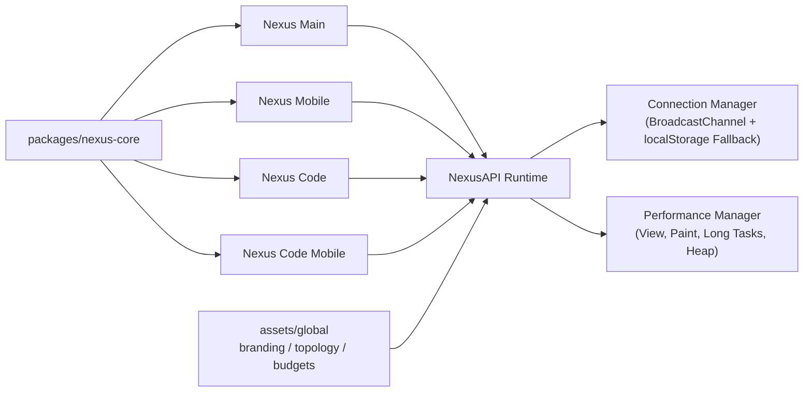

<div align="center">

# 🚀 Nexus Ecosystem

**Ein verbundenes Multi-App-System für `Nexus Main`, `Nexus Mobile`, `Nexus Code` und `Nexus Code Mobile`**

[](https://github.com/YoungJibbit95/Nexus-Ecosystem)


</div>

> [!IMPORTANT]
> Dieses Repository ist als **Ecosystem-Monorepo** aufgebaut: Alle Nexus-Versionen arbeiten über eine gemeinsame API-, Core- und Asset-Schicht zusammen.

> [!TIP]
> Wenn du nur testen willst: direkt zu **[🧪 Schnellstart für Nutzer](#-schnellstart-für-nutzer)** springen.

## ✨ Inhaltsverzeichnis

- [🎯 Was ist das Nexus Ecosystem?](#-was-ist-das-nexus-ecosystem)
- [🧩 Ecosystem-Komponenten](#-ecosystem-komponenten)
- [🏗️ Architektur auf einen Blick](#️-architektur-auf-einen-blick)
- [🧪 Schnellstart für Nutzer](#-schnellstart-für-nutzer)
- [🛠️ Setup für Entwickler](#️-setup-für-entwickler)
- [📦 Build-System & Artefakte](#-build-system--artefakte)
- [📱 Mobile Build (Android/iOS)](#-mobile-build-androidios)
- [⚡ NexusAPI & Performance](#-nexusapi--performance)
- [📋 GitHub Project Workflow](#-github-project-workflow)
- [🧯 Troubleshooting](#-troubleshooting)
- [📚 Weitere Doku](#-weitere-doku)

## 🎯 Was ist das Nexus Ecosystem?

Das Nexus Ecosystem verbindet mehrere Apps zu einer gemeinsamen Plattform:

- **Einheitliches Design- und Runtime-Verhalten** über Main + Mobile
- **Geteilte Kommunikation** über `API/nexus-api`
- **Globale Assets** (Branding, Topologie, Performance Budgets)
- **Zentraler Build-Flow** mit einem gemeinsamen `build/`-Ordner

Ziel: schnelle Weiterentwicklung bei stabiler Performance und klarer Wartbarkeit.

## 🧩 Ecosystem-Komponenten

| Bereich | Pfad | Zweck |
|---|---|---|
| Nexus Main | `Nexus Main/` | Desktop-App (Electron + React) |
| Nexus Mobile | `Nexus Mobile/` | Mobile App (Capacitor + React) |
| Nexus Code | `Nexus Code/` | Entwickler-/Code-Workspace (Desktop) |
| Nexus Code Mobile | `Nexus Code Mobile/` | Entwickler-/Code-Workspace (Mobile) |
| NexusAPI | `API/nexus-api/` | Verbindungen, Sync-Events, Performance-Monitoring |
| Shared Core | `packages/nexus-core/` | Gemeinsame Runtime-, UI- und View-Metadaten |
| Global Assets | `assets/global/` | Branding, Connection-Topologie, Performance-Budgets |
| Build Tooling | `tools/` | Ecosystem Build + Verification |

## 🏗️ Architektur auf einen Blick



## 🧪 Schnellstart für Nutzer

Dieser Weg ist für alle, die das Ecosystem **einfach starten und testen** wollen.

### 1. Repository klonen

```bash
git clone https://github.com/YoungJibbit95/Nexus-Ecosystem.git
cd Nexus-Ecosystem
```

### 2. Abhängigkeiten installieren

```bash
npm --prefix "./Nexus Main" install
npm --prefix "./Nexus Mobile" install
npm --prefix "./Nexus Code" install
npm --prefix "./Nexus Code Mobile" install
```

### 3. Komplett-Build ausführen

```bash
npm run build
```

### 4. Ergebnisse nutzen

Alle gebauten Ergebnisse landen zentral in `build/`.

| Ergebnis | Ort |
|---|---|
| Nexus Main Build | `build/Nexus Main/` |
| Nexus Mobile Build | `build/Nexus Mobile/` |
| Nexus Code Build | `build/Nexus Code/` |
| Nexus Code Mobile Build | `build/Nexus Code Mobile/` |
| Shared API Snapshot | `build/API/nexus-api/` |
| Shared Assets Snapshot | `build/assets/global/` |
| Build-Protokoll | `build/manifest.json` |

> [!NOTE]
> Wenn dein Android SDK korrekt eingerichtet ist, werden APK/AAB-Artefakte automatisch in den jeweiligen Mobile-Build-Ordner übernommen.

## 🛠️ Setup für Entwickler

### Voraussetzungen

| Tool | Empfehlung |
|---|---|
| Node.js | 20.x oder neuer |
| npm | 10.x oder neuer |
| Android Studio (optional) | Für Android-Build/Tests |
| Xcode (optional, macOS) | Für iOS-Build/Tests |

### Lokale Entwicklung starten

Vom Repo-Root aus:

```bash
npm run dev:main
npm run dev:mobile
npm run dev:code
npm run dev:code-mobile
```

> [!TIP]
> Nutze je App ein eigenes Terminal-Fenster, um alle Targets parallel laufen zu lassen.

<details>
<summary><strong>Warum ist alles verbunden, aber Mobile bleibt mobil-optimiert?</strong></summary>

- Gemeinsame Runtime- und View-Meta-Standards kommen aus `packages/nexus-core`
- Alle Apps nutzen `@nexus/api` für übergreifende Kommunikation
- Mobile Shell (Safe Area, Navigation, Touch-Flow) bleibt gerätespezifisch

Dadurch bekommst du konsistente Features + UX ohne Mobile-Layouts zu „verdesktoppen“.

</details>

## 📦 Build-System & Artefakte

### Wichtige Commands (Root)

| Command | Zweck |
|---|---|
| `npm run build` | Voller Ecosystem-Build inkl. Android-Versuch |
| `npm run build:ecosystem:fast` | Schneller Build ohne Android-Versuch |
| `npm run build:main` | Nur Nexus Main bauen |
| `npm run build:mobile` | Nur Nexus Mobile bauen |
| `npm run build:code` | Nur Nexus Code bauen |
| `npm run build:code-mobile` | Nur Nexus Code Mobile bauen |
| `npm run verify:ecosystem` | API-/Layout-/Integrations-Checks |

### Build-Ordnerstruktur

```text
build/
├── API/
│   └── nexus-api/
├── Nexus Main/
├── Nexus Mobile/
├── Nexus Code/
├── Nexus Code Mobile/
├── assets/
│   └── global/
└── manifest.json
```

## 📱 Mobile Build (Android/iOS)

### Nexus Mobile

```bash
npm --prefix "./Nexus Mobile" run cap:build:android
npm --prefix "./Nexus Mobile" run cap:build:ios
```

### Nexus Code Mobile

```bash
npm --prefix "./Nexus Code Mobile" run cap:sync
npm --prefix "./Nexus Code Mobile" run cap:android
npm --prefix "./Nexus Code Mobile" run cap:ios
```

> [!WARNING]
> Ohne korrektes SDK (`ANDROID_HOME`, `ANDROID_SDK_ROOT`, Xcode Tools) kann kein natives Artefakt erzeugt werden.

## ⚡ NexusAPI & Performance

`API/nexus-api` ist die zentrale Schicht für app-übergreifende Runtime-Prozesse.

### Kernpunkte

- Connection-Management zwischen allen 4 Nexus-Apps
- Event-Bus mit Fallback-Strategie (`BroadcastChannel` -> `localStorage`)
- State-Sync + Navigation-Sync
- Performance-Metriken mit Schutzmechanismen (Rate Limits + Ring Buffer)

### Beispielintegration

```ts
import { createNexusRuntime } from '@nexus/api'

const runtime = createNexusRuntime({
  appId: 'main',
  appVersion: '5.0.0'
})

runtime.start()
runtime.connection.syncState('main.activeView', 'dashboard')
runtime.performance.trackViewRender('main:dashboard')
```

## 📋 GitHub Project Workflow

- Repository: [Nexus-Ecosystem](https://github.com/YoungJibbit95/Nexus-Ecosystem)
- Project Board: [Project #2](https://github.com/users/YoungJibbit95/projects/2)

Empfohlener Flow pro Feature:

1. Card/Issue im Project anlegen
2. Branch + Umsetzung im passenden Modul
3. `npm run build` und `npm run verify:ecosystem` lokal ausführen
4. PR mit Card verlinken
5. Nach Merge Card in den nächsten Status verschieben

## 🧯 Troubleshooting

<details>
<summary><strong>Build bricht mit fehlenden Modulen ab</strong></summary>

In mindestens einem App-Ordner fehlen Dependencies. Die Install-Commands im Root-README einmal vollständig ausführen.

</details>

<details>
<summary><strong>Android-Artefakt fehlt im <code>build/</code>-Ordner</strong></summary>

Android SDK oder Umgebungsvariablen sind nicht verfügbar. Prüfe `ANDROID_HOME` und `ANDROID_SDK_ROOT` und starte dann erneut `npm run build`.

</details>

<details>
<summary><strong>Port-Konflikte in der Entwicklung</strong></summary>

Die Apps nutzen eigene Dev-Ports (`5173`-`5176`). Schließe alte Prozesse oder ändere den Port in der jeweiligen Vite-Konfiguration.

</details>

## 📚 Weitere Doku

- [NEXUS_API.md](./docs/NEXUS_API.md)
- [PROJECT_BOARD.md](./docs/PROJECT_BOARD.md)

---

<div align="center">

**Nexus Ecosystem** • Eine gemeinsame Basis für produktive Desktop- und Mobile-Apps ⚙️📱💻

</div>
