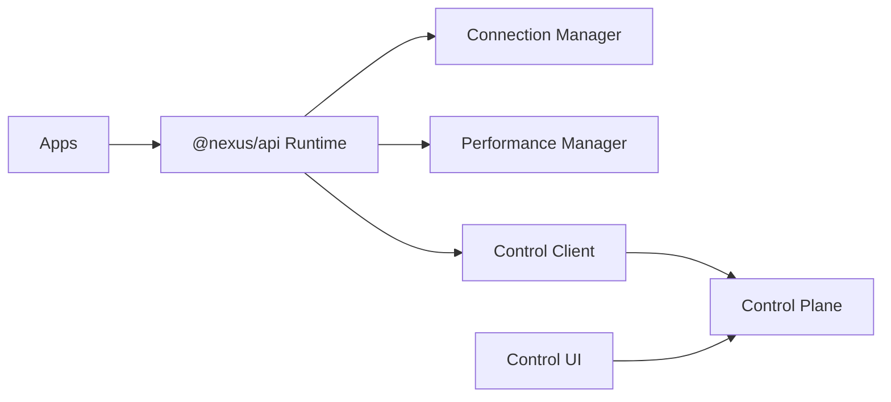

<div align="center">

# 🌌 NEXUS ECOSYSTEM V5

### ⚡ Modern • Clean • Cyberpunk Touch • Full Documentation


</div>

<div align="center">
  
## Nexus Wiki: youngjibbit95.github.io/Nexus-Ecosystem

</div>

---

> [!IMPORTANT]
> This public repo contains only the **Runtime Plane + API Client Layer (`@nexus/api`)**.  
> The production **Control Plane is hosted privately via `NEXUS_CONTROL_URL`**.

---

## 🎯 What is Nexus?

Nexus is a **multi-app ecosystem** where multiple applications share:

- ⚡ unified runtime  
- 🔗 shared API layer  
- 🎛️ central control plane  
- 📊 observability & performance tracking  

---

## 🧩 Components

| Component | Description |
|----------|------------|
| Nexus Main | Desktop App (Electron + React) |
| Nexus Mobile | Mobile App (Capacitor + React) |
| Nexus Code | Dev App (Desktop) |
| Nexus Code Mobile | Dev App (Mobile) |
| Nexus Control | Central UI (private) |
| Nexus API Client | Shared runtime (`packages/nexus-core`) |

---

## 🏗️ Architecture



---

## 🔄 Live Sync v2

- Feature sync across apps  
- Layout adaptation (mobile/desktop)  
- Capability-based updates  
- Release subscriptions  

---

## 🚀 Quick Start

```bash
git clone https://github.com/YoungJibbit95/Nexus-Ecosystem.git
cd Nexus-Ecosystem
npm run setup
npm run build
```

---

## 🛠️ Full Dev Commands

```bash
# setup
npm run setup
npm run api:source

# development
npm run dev:all
npm run dev:all:with-control-ui
npm run dev:main
npm run dev:main:web

npm run dev:mobile:android
npm run dev:mobile:ios

npm run dev:code
npm run dev:code-mobile:android
npm run dev:code-mobile:ios

# build
npm run build
npm run build:ecosystem:fast
npm run build:apps

# verification
npm run verify:ecosystem
npm run doctor:release
```

---

## ⚙️ Control Plane

- Hosted backend (`NEXUS_CONTROL_URL`)
- Auth / Config / Policies / Commands
- UI deployable separately
- Secure origin validation

---

## 🔐 Security

- Role-based system (`admin`, `developer`, etc.)
- Device verification
- HMAC mutation signatures
- Anti-replay protection
- Audit logging
- Owner-only mutations

---

## 📦 Build System

```txt
build/
├── Nexus Main
├── Nexus Mobile
├── Nexus Code
├── Nexus Control
├── API Client
└── assets
```

---

## 📋 Workflow

1. Create Issue  
2. Build Feature  
3. Run `verify:ecosystem`  
4. Create PR  
5. Deploy  

---

## 🧯 Troubleshooting

- Check API URL  
- Check `.env` config  
- Verify device  
- Check trusted origins  

---

## 📊 GitHub Stats

<p align="center">


</p>

---

## 🐍 Contribution Snake

<p align="center">

</p>

---

## 🌐 Connect

<p align="center">
<a href="https://github.com/YoungJibbit95">

</a>
<a href="https://instagram.com/nexusproject.dev">

</a>
<a href="mailto:nexusdevelopment.contact@gmail.com">

</a>
</p>

---

## 🧠 Philosophy

```txt
build > talk
systems > hacks
consistency > motivation
```

---

## 🚀 Vision

> Build a fully connected software ecosystem where apps evolve together.

---

<p align="center">

</p>
