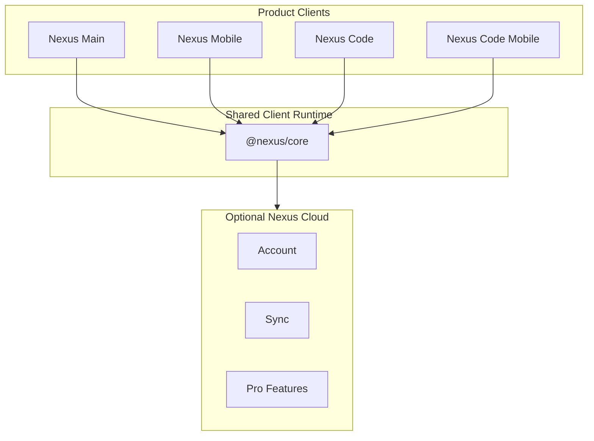

# Nexus Ecosystem

**A local-first workspace for notes, tasks, canvas, files and code - with optional Nexus Cloud.**

[Website](https://nexusproject.dev/) | [Docs](https://youngjibbit95.github.io/Nexus-Ecosystem/) | [Releases](https://github.com/YoungJibbit95/Nexus-Ecosystem/releases) | [Security](./SECURITY.md)

Nexus is an open client workspace built for everyday planning, writing, organizing and coding. The public repository contains the product clients, shared client runtime, public documentation and installer tooling that can be reviewed and built openly.

Nexus Cloud is optional and private. It provides account-based cloud features such as sync, backups, AI/Flux, multi-device workflows, sharing, team features and higher limits. Cloud and Pro permissions are enforced server-side; client-side UI gates are only user experience hints.

## What Is Nexus?

Nexus brings notes, tasks, reminders, canvas boards, files and code into one local-first workspace. The base client experience is designed to remain useful without production cloud credentials.

The project follows an open-core model: public clients and shared client runtime live here, while Nexus Cloud backend implementation, account logic, payment, sync infrastructure, admin tooling, deployment and secrets stay private.

This repository is for building and improving the public clients. It is not public API documentation and it does not contain backend secrets.

## Apps

| App | Role | Notes |
| --- | --- | --- |
| Nexus Main | Desktop workspace | Notes, tasks, reminders, canvas, files and embedded code workflows. |
| Nexus Mobile | Mobile workspace | Touch-first companion for the same local-first workflows. |
| Nexus Code | Desktop IDE | Editor, explorer, search, terminal, diagnostics and project workflows. |
| Nexus Code Mobile | Mobile coding companion | Lightweight mobile editor and project surface. |
| `@nexus/core` | Shared client runtime | Shared render, motion, view, capture and workspace contracts. |
| Installer tooling | Release support | Public build, packaging and checksum tooling for client releases. |

## Free vs Pro

| Area | Free local client | Pro / Nexus Cloud |
| --- | --- | --- |
| Workspace | Local notes, tasks, reminders, canvas and files | Cloud sync, backups and multi-device continuity |
| Code | Local editor and basic run workflows | Account-bound cloud features and higher usage limits |
| AI / Flux | Local UI surfaces where available | Cloud-backed AI/Flux and automation features |
| Sharing | Local export and handoff | Sharing, team workflows and account-based collaboration |
| Security | Public client guardrails | Server-side entitlement and cloud access enforcement |

The public clients do not contain backend secrets. Pro, sync, payment, AI usage, team features and cloud limits are enforced by Nexus Cloud.

## Public / Private Boundary

Public in this repository:

- Product clients
- Shared client runtime
- Local-first workspace behavior
- UI components and user-facing docs
- Installer and release tooling
- Client-side guardrails

Private outside this repository:

- Nexus Cloud backend
- Account/auth implementation
- Payment and billing implementation
- Sync engine and cloud storage
- AI/Flux orchestration
- Admin/control tooling
- Production deployment and infrastructure
- Secrets, signing material and abuse controls

Read the full boundary in [docs/PUBLIC_PRIVATE_BOUNDARY.md](./docs/PUBLIC_PRIVATE_BOUNDARY.md).



## Getting Started

```bash
git clone https://github.com/YoungJibbit95/Nexus-Ecosystem.git
cd Nexus-Ecosystem
npm run setup
npm run dev:main
npm run dev:code
```

Mobile web iteration:

```bash
npm run dev:mobile:web
npm run dev:code-mobile:web
```

## Development

```bash
npm run build:main
npm run build:mobile
npm run build:code
npm run build:code-mobile
npm run verify:ecosystem
npm run check:no-private-strings
npm run check:secrets
```

Most public client development should work without production cloud credentials. Client-side environment variables are public configuration, never secrets. See [docs/ENVIRONMENT.md](./docs/ENVIRONMENT.md).

## Security

Nexus desktop clients use Electron guardrails such as context isolation, disabled Node integration in renderers, preload allowlists and workspace-bound file access. Mobile clients use Capacitor and keep native capabilities explicit.

Security principles:

- No secrets belong in the public repository.
- Client configuration is public.
- Cloud and Pro access is enforced server-side.
- Local workspace features remain useful without private backend code.
- Vulnerabilities should be reported privately.

Read [SECURITY.md](./SECURITY.md) and [docs/SECURITY_MODEL.md](./docs/SECURITY_MODEL.md).

## Releases

Client releases are published through GitHub Releases with platform-specific artifacts and checksums where available. Release documentation is in [docs/RELEASES.md](./docs/RELEASES.md).

Internal Nexus Cloud deployment, admin tooling and server rollout details are not part of this public repository.

## Contributing

Contributions are welcome for public clients, shared runtime, UI, docs, tests and release tooling. Backend/API, payment, account, sync, admin/control and infrastructure changes are not handled in this repository.

Read [CONTRIBUTING.md](./CONTRIBUTING.md) and [SUPPORT.md](./SUPPORT.md).

## License

The final public license decision is documented as pending in [docs/VERSIONING.md](./docs/VERSIONING.md). Do not assume rights beyond the repository's published license state until a license file is added.
