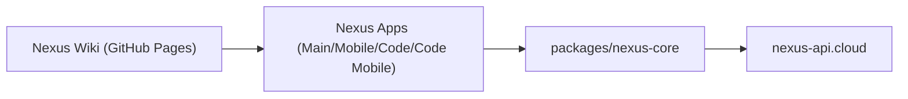

# Nexus Ecosystem


[](https://github.com/YoungJibbit95/YJarvis/stargazers)
[](https://github.com/YoungJibbit95/YJarvis/network/members)
[](https://github.com/YoungJibbit95/YJarvis/commits/main)

Nexus ist ein Multi-App Workspace-System fuer Produktivitaet, Planung und Entwicklung.
Dieses Repository enthaelt die Client-Apps (Desktop + Mobile), den gemeinsamen Core und die Wiki-Doku.

- Produkt-Wiki (GitHub Pages): https://youngjibbit95.github.io/Nexus-Ecosystem
- Produktions-API-Ziel fuer Clients: `https://nexus-api.cloud`

## Was Nexus ist

Nexus vereint mehrere Arbeitsflaechen in einem konsistenten UX- und Command-System:

- Planen und steuern: `dashboard`, `tasks`, `reminders`, `canvas`, `flux`
- Dokumentieren: `notes` mit Markdown + Magic-Elementen
- Entwickeln: `Nexus Code` / `Nexus Code Mobile`
- Organisieren: `files` + Workspace-Ordner-Flow
- Navigieren: Spotlight, Terminal, Quick Actions

Zielbild:

- Schnell in der Nutzung (wenige Klicks, klare Shortcuts)
- Umfangreich in den Funktionen (Magic Blocks, Canvas, Workspaces, IDE-Flows)
- Einheitlich ueber alle Apps (Desktop und Mobile Paritaet)

## Apps im Monorepo

- `Nexus Main` (Electron): Haupt-Desktop-App
- `Nexus Mobile` (Capacitor): Mobile Haupt-App
- `Nexus Code` (Electron): Lightweight IDE
- `Nexus Code Mobile` (Capacitor): Mobile Code-App
- `packages/nexus-core`: Shared Runtime, API-Client, Sync-/Validation-Logik
- `Nexus Wiki`: Doku fuer GitHub Pages

## View-Guide

### Nexus Main / Nexus Mobile

- `dashboard`
  - Widget-Board mit Layout-Editor
  - Fokus auf Uebersicht, Prioritaeten, schnelle Navigation
- `notes`
  - Markdown Editor (Edit/Split/Preview)
  - Magic Blocks (`nexus-list`, `nexus-checklist`, `nexus-alert`, `nexus-progress`, `nexus-timeline`, `nexus-grid`, `nexus-card`, `nexus-metrics`, `nexus-steps`, `nexus-quadrant`, `nexus-kanban`, `nexus-callout`)
  - Import/Export von `.md`
- `tasks`
  - Kanban-Flow mit Prioritaeten, Tags, Subtasks, Deadlines
- `reminders`
  - Reminder-Zeitfenster, Snooze, Repeat, Overdue-Flow
- `canvas`
  - Infinite Board mit PM-Nodes, Connections, Auto-Layout
  - Magic Presets erzeugen zentrale Hub-Nodes
  - Export als JSON + Markdown (lesbar fuer Menschen/AI)
- `files`
  - Workspace-Ordner und Dateifokus ueber die App-Objekte
- `flux`
  - Ops-Center fuer Queue, Bottlenecks, Quick-Create
- `devtools`
  - Builder-/Calculator-Helfer fuer schnelle UI-Arbeit
- `settings`
  - Theme, Panel-Background, Motion, Layout, Presets
- `info`
  - In-App Dokumentation, Changelog, Keybind-Referenz

### Nexus Code / Nexus Code Mobile

- Monaco-basierter Editor
- Datei-/Tab-Workflows
- Run/Preview-/Output-Flows
- Terminal-Integration
- Visuelle Paritaet zu Nexus Main (Panel-/Theme-System)

## Kern-Shortcuts

- Global:
  - `Cmd/Ctrl+S` Speichern (Editor-Views)
  - `Esc` Dialog/Selection schliessen
- Notes:
  - `Cmd/Ctrl+B` Fett
  - `Cmd/Ctrl+I` Kursiv
  - `Cmd/Ctrl+K` Link
  - `Cmd/Ctrl+Z` Undo
  - `Cmd/Ctrl+Y` Redo
- Canvas:
  - `Cmd/Ctrl+M` Magic Builder
  - `Cmd/Ctrl+0` View Reset
  - `+` / `-` Zoom
  - `G` Grid Toggle
  - `F` Fit/Focus
- Code:
  - `Cmd/Ctrl+Enter` Run
  - `Cmd/Ctrl+S` Save

## Architektur (High-Level)



Hinweis: Der eigentliche API-Server liegt bewusst ausserhalb dieses Repos.

## Repository-Struktur

```text
Nexus-Ecosystem/
  Nexus Main/
  Nexus Mobile/
  Nexus Code/
  Nexus Code Mobile/
  packages/
    nexus-core/
  Nexus Wiki/
  tools/
```

## Voraussetzungen

- Node.js 20+
- npm 10+
- macOS fuer Electron-Desktop-Dev empfohlen
- Android-Toolchain fuer mobile Android Builds (optional)

## Setup

```bash
git clone https://github.com/YoungJibbit95/Nexus-Ecosystem.git
cd Nexus-Ecosystem
npm run setup
```

## Entwicklung

```bash
# Main + Code (ohne Control UI)
npm run dev:all

# Main + Code + Control UI
npm run dev:all:with-control-ui

# Einzelstarts
npm run dev:main
npm run dev:code
npm run dev:mobile:android
npm run dev:code-mobile:android
```

## Build und Verifikation

```bash
npm run build:ecosystem
npm run verify:ecosystem
npm run doctor:release
```

## Environment (ohne Secret-Werte)

Alle Apps sind auf denselben API-Host ausgerichtet:

- `VITE_NEXUS_CONTROL_URL=https://nexus-api.cloud`
- `VITE_NEXUS_CONTROL_INGEST_KEY=<pro-app key>`
- optional:
  - `VITE_NEXUS_USER_ID`
  - `VITE_NEXUS_USERNAME`
  - `VITE_NEXUS_USER_TIER`

## Troubleshooting

### `Port 5173 is already in use`

Es laeuft bereits ein Vite-Prozess. Beende den alten Prozess oder starte danach erneut:

```bash
lsof -i :5173
kill -9 <PID>
```

### App startet in Dev, aber nicht als Build

- Architektur pruefen (Apple Silicon: ARM64 Build/Start verwenden)
- Parallel laufende alte Electron-Instanzen beenden
- Build neu erzeugen (`npm run build:ecosystem`)

### API nicht erreichbar

- Host pruefen: `https://nexus-api.cloud`
- Netzwerk/TLS pruefen
- In Logs nach `LOCAL_FALLBACK-*` suchen (sollte in Production nicht auftreten)

## Security- und Repo-Grenzen

Dieses Repository enthaelt **keine private API-Implementierung**.

- im Repo:
  - Clients
  - Shared Core
  - Build-/Setup-Tooling
  - Wiki
- ausserhalb:
  - API-Server-Repo
  - Infrastruktur/Secrets

Bitte keine Secrets in Commits oder `.env` Dateien einchecken.

## Beitrag und Pflege

- Paritaet beachten: relevante Desktop-Aenderungen nach Mobile uebertragen
- Bei API-/Core-Aenderungen auf alle vier Apps testen
- Doku (InfoView + README + Wiki) bei Feature-Aenderungen direkt aktualisieren
