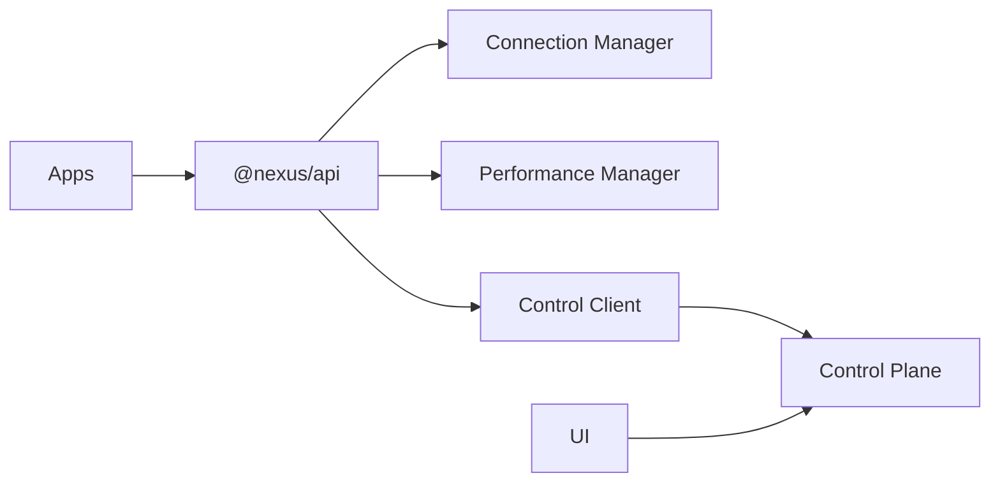

<div align="center">

# 🌌 NEXUS ECOSYSTEM V5

### ⚡ Cyberpunk • Modular • Scalable • Full System Architecture


</div>

---

> [!IMPORTANT]
> Public Repo enthält nur **Runtime Plane + API Client Layer**.  
> Die produktive **Control Plane läuft privat (NEXUS_CONTROL_URL)**.

---

## 🧠 SYSTEM OVERVIEW

```txt
STATUS:        ONLINE
RUNTIME:       ACTIVE
CONTROL:       CONNECTED
SYNC:          LIVE
SECURITY:      ENFORCED
```

---

## 🎯 WHAT IS NEXUS?

Ein **Multi-App Ecosystem**, bestehend aus:

- 🧩 mehreren Apps (Desktop + Mobile)
- 🔗 gemeinsamer Runtime (`@nexus/api`)
- 🎛️ zentraler Control Plane
- 📊 Observability + Performance Tracking

---

## 🧩 COMPONENTS

- Nexus Main (Electron + React)
- Nexus Mobile (Capacitor + React)
- Nexus Code (Dev App)
- Nexus Code Mobile
- Nexus Control (private)
- Nexus API Client (`nexus-core`)

---

## 🏗️ ARCHITECTURE



---

## 🔄 LIVE SYNC V2

- automatische Feature Synchronisation
- Layout Anpassung (mobile/desktop)
- Capability-based Updates
- Control Panel Integration

---

## 🚀 QUICK START

```bash
git clone https://github.com/YoungJibbit95/Nexus-Ecosystem.git
cd Nexus-Ecosystem
npm run setup
npm run build
```

---

## 🛠️ DEV COMMANDS

```bash
npm run dev:all
npm run dev:main
npm run dev:mobile
npm run build
npm run verify:ecosystem
```

---

## ⚙️ CONTROL PLANE

- Hosted API (extern)
- Auth / Policies / Commands
- UI separat deploybar
- sichere Origin Policies

---

## 🔐 SECURITY

- Role-based system
- Device verification
- HMAC signatures
- Anti-replay protection
- Audit logging
- Owner-only mutations

---

## 📦 BUILD SYSTEM

```txt
build/
├── Apps
├── API Client
├── Control UI
└── Assets
```

---

## 📊 GITHUB STATS

<p align="center">


</p>

---

## 🐍 CONTRIBUTION SNAKE

<p align="center">

</p>

---

## 📋 WORKFLOW

1. Create Issue
2. Build Feature
3. Verify + Build
4. PR + Review
5. Deploy

---

## 🧯 TROUBLESHOOTING

- API erreichbar?
- richtige ENV gesetzt?
- Device verified?
- Origin erlaubt?

---

## 📚 DOCS

- Developer Guide
- User Guide
- Security Docs
- Control Panel Setup

---

## 🌐 CONNECT

<p align="center">
<a href="https://github.com/YoungJibbit95">

</a>
<a href="https://instagram.com/nexusproject.dev">

</a>
<a href="mailto:nexusdevelopment.contact@gmail.com">

</a>
</p>

---

## 🧠 PHILOSOPHY

```txt
build > talk
systems > hacks
consistency > motivation
```

---

## 🚀 VISION

> Build a fully connected software ecosystem.

---

<p align="center">

</p>
