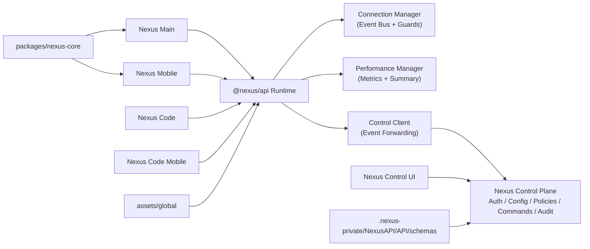

<div align="center">

# 🚀 Nexus Ecosystem

**Ein verbundenes Multi-App-System mit zentralem Control Plane und Control UI**

[](https://github.com/YoungJibbit95/Nexus-Ecosystem)


</div>

> [!IMPORTANT]
> Das Ecosystem ist jetzt in **Runtime Plane** (`@nexus/api` in den Apps) und **Control Plane** (`.nexus-private/NexusAPI/API/nexus-control-plane` + `Nexus Control`) aufgeteilt.

## ✨ Inhaltsverzeichnis

- [🎯 Was ist das Nexus Ecosystem?](#-was-ist-das-nexus-ecosystem)
- [🧩 Komponenten](#-komponenten)
- [🏗️ Architektur](#️-architektur)
- [🧪 Schnellstart für Nutzer](#-schnellstart-für-nutzer)
- [🛠️ Setup für Entwickler](#️-setup-für-entwickler)
- [⚙️ Control Plane + UI starten](#️-control-plane--ui-starten)
- [🔐 Security-Features](#-security-features)
- [📦 Build-System & Artefakte](#-build-system--artefakte)
- [🧭 API-Konfiguration in Apps](#-api-konfiguration-in-apps)
- [📋 GitHub Project Workflow](#-github-project-workflow)
- [🧯 Troubleshooting](#-troubleshooting)
- [📚 Doku](#-doku)

## 🎯 Was ist das Nexus Ecosystem?

Ein Monorepo mit mehreren Nexus-Apps, die ueber gemeinsame Runtime-, API- und Control-Layer zusammenarbeiten.

Ziele:

- konsistente Features ueber Desktop und Mobile
- zentrale Steuerung und Beobachtbarkeit
- hohe Wartbarkeit durch gemeinsame Contracts
- performance-orientierte Build- und Verify-Pipeline

## 🧩 Komponenten

| Bereich | Pfad | Rolle |
|---|---|---|
| Nexus Main | `Nexus Main/` | Desktop-App (Electron + React) |
| Nexus Mobile | `Nexus Mobile/` | Mobile App (Capacitor + React) |
| Nexus Code | `Nexus Code/` | Dev-/Code-App (Desktop) |
| Nexus Code Mobile | `Nexus Code Mobile/` | Dev-/Code-App (Mobile) |
| Nexus Control | `Nexus Control/` | Zentrale Management-UI |
| NexusAPI | `.nexus-private/NexusAPI/API/nexus-api/` | Shared Runtime API (Connection, Perf, Control Client) |
| Nexus Control Plane | `.nexus-private/NexusAPI/API/nexus-control-plane/` | Backend fuer Auth, Config, Policies, Commands, Audit |
| Nexus Schemas | `.nexus-private/NexusAPI/API/schemas/` | Zentrale Contracts und Validatoren |
| Shared Core | `packages/nexus-core/` | Gemeinsame Runtime/UI-Helfer |
| Global Assets | `assets/global/` | Branding, Topologie, Budgets |

## 🏗️ Architektur



## 🧪 Schnellstart für Nutzer

### 1) Klonen

```bash
git clone https://github.com/YoungJibbit95/Nexus-Ecosystem.git
cd Nexus-Ecosystem
```

### 2) Setup ausfuehren

```bash
npm run setup
```

Der Setup-Command installiert alle relevanten Teilprojekte und legt `.env.local` Defaults fuer App->Control-Plane Kommunikation an.

### 3) Komplett bauen

```bash
npm run build
```

### 4) Ergebnis ansehen

Alle Artefakte landen zentral in `build/`.

## 🛠️ Setup für Entwickler

### Voraussetzungen

| Tool | Empfehlung |
|---|---|
| Node.js | 20.x+ |
| npm | 10.x+ |
| Android Studio (optional) | Android Builds |
| Xcode (optional, macOS) | iOS Builds |

### Private API Source (empfohlen)

```bash
# private NexusAPI Repo klonen/aktualisieren
npm run api:private:sync

# zeigt die aktuell aktive API-Quelle (private-only)
npm run api:private:source
```

Standardverhalten:

- Das Ecosystem nutzt ausschliesslich die private Quelle unter `.nexus-private/NexusAPI`.
- Wenn die private Quelle fehlt oder unvollstaendig ist, stoppen Setup/Dev/Build mit Fehler.

### App-Entwicklung (Runtime Plane)

```bash
npm run control:ensure  # API-Guard: startet Control Plane falls noetig
npm run dev:all       # Core Dev-Stack (Control + Main + Code)
npm run dev:main      # Nexus Main in Electron
npm run dev:main:web  # Nexus Main nur im Browser (Vite)
npm run dev:mobile:android
npm run dev:mobile:ios
npm run dev:code
npm run dev:code-mobile:android
npm run dev:code-mobile:ios
```

Mobile Apps werden nativ ueber Capacitor gestartet (`npx cap open ios|android`), nicht ueber Vite-Devserver.
Alle Root-`dev` und Root-`build` Commands erzwingen vorher automatisch eine aktive Control Plane.

Admin-/Device-Bootstrap (lokal):

```bash
# User auf admin setzen/erstellen + optional Device direkt freischalten
npm run security:make-admin -- --username <deinName> --password <deinPasswort> --device-id <deineDeviceId>

# einzelnes Device freischalten
npm run security:approve-device -- --device-id <deineDeviceId> --roles admin,developer
```

Mutation Signing Secret (Pflicht fuer mutierende API-Aktionen):

```bash
npm run security:signing-secret -- --username youngjibbit
# danach als Env setzen, z. B.
export NEXUS_MUTATION_SIGNING_SECRETS="youngjibbit:<deinSecret>"
```

Mehrere berechtigte Personen:

```bash
export NEXUS_MUTATION_SIGNING_SECRETS="youngjibbit:<secretA>,trusteddev:<secretB>"
```

## ⚙️ Control Plane + UI starten

### 1) Control Plane starten

```bash
npm run dev:control-plane
```

Default URL: `http://localhost:4399`

### 2) Control UI starten

```bash
npm run dev:control
```

Default URL: `http://localhost:5180`

### 3) Alles in einem Schritt starten (inkl. Browser öffnen)

```bash
npm run dev:control:open
```

Startet Control Plane + Control UI und öffnet automatisch `http://localhost:5180`.

### 3) Einloggen

Lokale Default-Accounts:

- `admin / change-me-now`
- `developer / developer-local`
- `viewer / viewer-local`

> [!WARNING]
> Default-Zugangsdaten sind nur fuer lokale Entwicklung gedacht und muessen in produktiven Umgebungen ersetzt werden.

### 4) Control UI auf GitHub Pages (optional)

Neuer Workflow: `.github/workflows/deploy-control-pages.yml`

Optional vor dem Deploy in GitHub Repository Variables setzen:

- `NEXUS_CONTROL_PUBLIC_API_URL` = oeffentliche HTTPS URL deiner laufenden Control Plane

Wenn die Variable fehlt, deployed die UI trotzdem (Fallback auf `http://127.0.0.1:4399`, API-Feld bleibt editierbar).

Der Workflow baut `Nexus Control/dist` mit Runtime-Config und deployed die UI auf GitHub Pages.
Die UI verbindet sich dann weiter mit der API ueber `GET /api/v1/public/bootstrap` (Handshake) und die normalen Auth/API-Endpunkte.

## 🔐 Security-Features

- Rollenbasiertes API-Modell (`admin`, `developer`, `viewer`, `agent`)
- Device-Verification fuer privilegierte Rollen (`admin`, `developer`)
- Owner-Lock fuer API-Mutationen (`ownerUsernames` + `restrictMutationsToOwner`)
- Owner-Only Login fuer Control Panel (`ownerOnlyControlPanel` + `controlPanelAllowedUsernames`)
- Kryptografische HMAC-Signaturpflicht fuer Mutationen (`X-Nexus-Signature-*`)
- Replay-Schutz via Nonce + Zeitfenster (`mutationSignatureNonceTtlSec`, `mutationSignatureMaxSkewSec`)
- Sliding-Window Rate Limiting im Control Plane
- Idempotency-Key Support fuer Commands
- Ingest-Schutz via Bearer Token oder `X-Nexus-Ingest-Key`
- CORS-Policy ueber `trustedOrigins`
- Interne Server binden nur an `127.0.0.1` (kein `0.0.0.0`)
- Keine globalen Electron Session-Overrides (`defaultSession`, `webRequest`, `setProxy`)
- Payload-Guards in `NexusConnectionManager` (`maxPayloadBytes`)
- Event-Validation und Event-Age Guards
- Audit-Log fuer sicherheitsrelevante Aktionen
- Security-Baseline Check beim Server-Start (unsichere Policies werden blockiert)

Admin/Developer-Logins sind nur mit `X-Nexus-Device-Id` und freigegebenem Geraet moeglich.
Zusatz: Mutierende API-Calls (Config/Policies/Devices/Commands) sind auf den Owner-Account beschraenkt (`youngjibbit`), auch wenn andere Rollen `admin`/`developer` besitzen.

Command-Sicherheit:

- `POST /api/v1/commands` ist owner-only.
- Commands haben keinen direkten User-/Role-Write-Endpunkt und koennen keine Accounts hochstufen.
- Ohne gueltige Mutation-Signatur koennen keine schreibenden API-Endpunkte ausgefuehrt werden.

Default `trustedOrigins` (lokal) sind auf die bekannten Dev-Origins begrenzt:

- `http://localhost:5173-5176` (Main/Mobile/Code/Code Mobile)
- `http://localhost:5180-5181` (Control UI Dev/Preview)
- `http://127.0.0.1:5173-5176` und `http://127.0.0.1:5180-5181`
- `capacitor://localhost`, `ionic://localhost`

Fuer GitHub Pages muss deine Pages-Origin zusaetzlich explizit in `trustedOrigins` stehen, z. B.:

- `https://youngjibbit95.github.io`

Die Wildcard `*` sollte fuer sichere Setups nicht verwendet werden.

## 📦 Build-System & Artefakte

### Wichtige Commands (Root)

| Command | Zweck |
|---|---|
| `npm run setup` | Vollstaendiges Local Setup (Install + `.env.local` Defaults) |
| `npm run api:private:sync` | Synchronisiert private `NexusAPI` Quelle |
| `npm run api:private:source` | Zeigt aktive API-Quelle + Pfade an |
| `npm run control:ensure` | Erzwingt, dass die Control Plane aktiv ist |
| `npm run dev:all` | Startet den Core-Stack (Control Plane, Control UI, Main, Code) |
| `npm run dev:all:no-open` | Wie `dev:all`, aber ohne Browser-Autostart |
| `npm run dev:mobile:android` | Nexus Mobile nativ (build + cap sync + Android Studio) |
| `npm run dev:mobile:ios` | Nexus Mobile nativ (build + cap sync + Xcode) |
| `npm run dev:code-mobile:android` | Nexus Code Mobile nativ (build + cap sync + Android Studio) |
| `npm run dev:code-mobile:ios` | Nexus Code Mobile nativ (build + cap sync + Xcode) |
| `npm run security:make-admin -- --username ... --password ...` | Admin-User lokal erstellen/aktualisieren |
| `npm run security:approve-device -- --device-id ...` | Device lokal fuer Rollen freischalten |
| `npm run security:signing-secret -- --username ...` | Erzeugt Mutation Signing Secret fuer Owner/Trusted Devs |
| `npm run build` | Voller Ecosystem Build (inkl. Android-Versuch) |
| `npm run build:electron:installers` | Baut beide Electron-Apps inkl. macOS+Windows Installer |
| `npm run build:main` | Baut `Nexus Main` inkl. macOS+Windows Installer |
| `npm run build:code` | Baut `Nexus Code` inkl. macOS+Windows Installer |
| `npm run build:ecosystem:fast` | Schneller Build ohne Android-Versuch |
| `npm run build:apps` | Alle Frontend-Apps bauen |
| `npm run build:control-plane` | Control Plane Build Snapshot |
| `npm run verify:ecosystem` | Integrations-/Security-/Layout-Checks |

### Build-Ordner

```text
build/
├── API/
│   ├── nexus-api/
│   ├── nexus-control-plane/
│   └── schemas/
├── Nexus Main/
├── Nexus Mobile/
├── Nexus Code/
├── Nexus Code Mobile/
├── Nexus Control/
├── assets/
│   └── global/
└── manifest.json
```

Electron-Installer landen pro App in:

- `Nexus Main/release/`
- `Nexus Code/release/`

Der GitHub Workflow `.github/workflows/build-installers.yml` erzeugt diese Installer auch automatisiert auf nativen Runnern:

- `macos-latest` -> `.dmg`/`.pkg`
- `windows-latest` -> `.exe`/`.msi`

## 🧭 API-Konfiguration in Apps

Alle Apps koennen optional in die Control Plane reporten.

Vite Env Variablen:

- `VITE_NEXUS_CONTROL_URL` (z. B. `http://localhost:4399`)
- `VITE_NEXUS_CONTROL_INGEST_KEY` (passend zur Policy)
- `VITE_NEXUS_USER_ID` (optional, User-Template Mapping)
- `VITE_NEXUS_USERNAME` (optional, User-Template Mapping)
- `VITE_NEXUS_USER_TIER` (`free`/`paid`, optionaler Tier-Override)

Wenn `VITE_NEXUS_CONTROL_URL` gesetzt ist, aktiviert `createNexusRuntime(...)` automatisch den Control Client.

View-Paywalls:

- Control Plane Endpoint: `POST /api/v1/views/validate`
- Control Panel Tab: `Paywalls` (globaler Toggle, Tier-Templates, Free/Paid-User-Templates)
- Apps validieren View-Wechsel gegen die API, bevor gesperrte Views gerendert werden.

## 📋 GitHub Project Workflow

- Repo: [Nexus-Ecosystem](https://github.com/YoungJibbit95/Nexus-Ecosystem)
- Board: [Project #2](https://github.com/users/YoungJibbit95/projects/2)

Empfohlener Flow:

1. Card/Issue anlegen
2. Branch + Umsetzung
3. `npm run verify:ecosystem` und `npm run build`
4. PR mit Project Card verknuepfen
5. Nach Merge Card weiterschieben

Zusatz fuer Security-Governance auf GitHub:

1. Branch Protection auf `main` aktivieren
2. Required Status Check: `verify-ecosystem` (Job aus Workflow `Security Verify`)
3. CODEOWNERS-Reviews fuer API/Electron/Tooling erzwingen
4. Dependabot aktiv halten (`.github/dependabot.yml`)
5. CodeQL aktiv halten (`.github/workflows/codeql.yml`)
6. Security Policy ueber GitHub Security Tab verwenden (`.github/SECURITY.md`)

## 🔒 Public vs Private Strategie

Wenn dein Ziel ist, dass der Core Open Source bleibt, aber Security/Serverlogik nur von dir steuerbar ist:

1. **Public Repo** fuer Apps, Shared Runtime, UI-Core (dieses Monorepo ist dafuer geeignet).
2. **Private Runtime fuer Betrieb**:
   - produktiven Control Plane in privater Infrastruktur deployen,
   - Secrets nur serverseitig halten (`NEXUS_MUTATION_SIGNING_SECRETS`),
   - mutierende Rechte ueber `ownerUsernames` + Device-Verify + Signatur erzwingen.
3. **Optional separates Private Repo** fuer Deployment/IaC/Secrets-Handling (empfohlen).

Kurz: Public Core ist sinnvoll, aber der wirklich autoritative Control Plane sollte privat betrieben werden.

## 🧯 Troubleshooting

<details>
<summary><strong>Control UI kann sich nicht einloggen</strong></summary>

- laeuft der Control Plane Dienst auf der eingestellten URL?
- stimmt Benutzername/Passwort?
- ist im UI die richtige API URL hinterlegt?
- wird `X-Nexus-Device-Id` gesetzt (im UI unter API Settings sichtbar)?
- ist das Device fuer die Rolle (`admin`/`developer`) freigegeben?

</details>

<details>
<summary><strong>Apps erscheinen als stale im Dashboard</strong></summary>

- App laeuft nicht oder reportet nicht an die Control Plane
- `VITE_NEXUS_CONTROL_URL`/Ingest-Key fehlen oder sind falsch
- `trustedOrigins` decken den App-Origin nicht ab

</details>

<details>
<summary><strong>Android-Artefakte fehlen im Build</strong></summary>

- `ANDROID_HOME` oder `ANDROID_SDK_ROOT` nicht gesetzt
- Gradle/SDK lokal nicht verfuegbar

</details>

## 📚 Doku

- [NEXUS_API.md](./docs/NEXUS_API.md)
- [PROJECT_BOARD.md](./docs/PROJECT_BOARD.md)
- [ENVIRONMENT.md](./docs/ENVIRONMENT.md)
- [SECURITY.md](./docs/SECURITY.md)
- [Nexus Control/README.md](./Nexus%20Control/README.md)
- Private API Repo (Owner-only): [YoungJibbit95/NexusAPI](https://github.com/YoungJibbit95/NexusAPI)

---

<div align="center">

**Nexus Ecosystem** • Runtime Plane + Control Plane fuer robuste, skalierbare Nexus-Apps ⚙️

</div>
