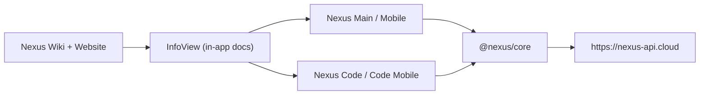

# Nexus Ecosystem

[](./README.md)
[](./packages/nexus-core/README.md)


Nexus ist ein Multi-App Workspace-System fuer Planung, Entwicklung und Daily Operations.
Dieses Repository enthaelt die produktiven Clients, Shared Core Runtime-Logik und die Wiki-/Website-Dokumentation.

## Quick Links

- [Nexus Main README](./Nexus%20Main/README.md)
- [Nexus Mobile README](./Nexus%20Mobile/README.md)
- [Nexus Code README](./Nexus%20Code/README.md)
- [Nexus Code Mobile README](./Nexus%20Code%20Mobile/README.md)
- [Nexus Native Installer README](./Nexus%20Installer/README.md)
- [@nexus/core README](./packages/nexus-core/README.md)
- [Nexus Wiki README](./Nexus%20Wiki/README.md)
- [nexusproject.dev README](./nexusproject.dev/README.md)

## Product Surface

| App | Platform | Primary Scope | Stack |
| --- | --- | --- | --- |
| `Nexus Main` | Desktop | planning, notes, tasks, canvas, workspace | Electron + React + Vite |
| `Nexus Mobile` | Android/iOS | mobile parity for core workspace flows | Capacitor + React + Vite |
| `Nexus Code` | Desktop IDE | editor, run/debug, terminal, project workflow | Electron + React + Vite |
| `Nexus Code Mobile` | Android/iOS IDE | mobile coding and project ops | Capacitor + React + Vite |

## Core View Matrix (Main/Mobile)

| View | Primary Job | Key Capabilities |
| --- | --- | --- |
| `dashboard` | command center | Today layer, resume lane, quick capture, workspace context, engine health |
| `notes` | knowledge and docs | markdown editor, preview/reading mode, templates, backlinks and linking helpers |
| `tasks` | execution | kanban lanes, focus lane, priorities/deadlines, batch actions |
| `reminders` | scheduling | due/overdue grouping, snooze/completion, health/control center |
| `canvas` | visual planning | node graph, templates/magic, auto-layout, inspector, keyboard/pointer flows |
| `files` | workspace and handoff | workspace folders, import/export handoff, status and history surfaces |
| `flux` | ops and throughput | queue/signal view, action routing, bottleneck support |
| `code` | embedded coding view | fast edit/run path integrated in Main/Mobile shell |
| `devtools` | internal tooling | diagnostics, recipe/testing surfaces, development helpers |
| `settings` | system controls | appearance, typography, panel behavior, motion/render controls |
| `info` | in-app docs | architecture, diagnostics explanation, view guides and release notes |

## Architecture



## Render and Motion Pipeline

All clients are aligned to the shared runtime model in `@nexus/core`.

- Render pipeline phases:
  `Measure -> Resolve -> Allocate -> Commit -> Cleanup`
- Surface/effect resolution:
  `surfaceClass`, `effectClass`, `budgetPriority`, `visibilityState`, `interactionState`
- Motion capability/degradation:
  `full`, `rich-reduced`, `composed-light`, `critical-only`, `static-safe`
- Guardrails:
  `transform`, `filter`, and `opacity` ownership is centrally coordinated to prevent conflicts.

This keeps UX smooth while still degrading safely under low power, reduced motion, or lag pressure.

## Repository Map

| Area | Purpose |
| --- | --- |
| `Nexus Main/` | desktop workspace app |
| `Nexus Mobile/` | mobile workspace app |
| `Nexus Code/` | desktop IDE app |
| `Nexus Code Mobile/` | mobile IDE app |
| `Nexus Installer/` | native Rust installer for build+install from GitHub |
| `packages/nexus-core/` | shared render/motion/runtime contracts |
| `packages/nexus-api/` | shared API clients/contracts |
| `tools/` | verify/release guard scripts |
| `Nexus Wiki/` | wiki site source |
| `nexusproject.dev/` | website source |

## Getting Started

```bash
git clone https://github.com/YoungJibbit95/Nexus-Ecosystem.git
cd Nexus-Ecosystem
npm run setup
```

## Development

```bash
npm run dev:all
npm run dev:all:with-control-ui
npm run dev:main
npm run dev:mobile:web
npm run dev:code
npm run dev:code-mobile:web
```

## Build and Verify

```bash
npm run build:ecosystem
npm run verify:single-react
npm run verify:ecosystem
npm run doctor:release
```

## Dependency Baseline (April 2026)

Major dependency refresh is applied across all 4 apps and validated with full builds plus verify scripts.

- React / React DOM: `19.2.x`
- Framer Motion: `12.38.x`
- Lucide React: `1.8.x`
- Monaco Editor: `0.55.x`
- Three.js: `0.184.x`
- Zustand: `5.0.x`
- React Markdown: `10.1.x`

Security checks (high severity, production deps) currently report `0 vulnerabilities` for:

- `Nexus Main`
- `Nexus Mobile`
- `Nexus Code`
- `Nexus Code Mobile`

## Environment

Production API host:

- `VITE_NEXUS_CONTROL_URL=https://nexus-api.cloud`
- `VITE_NEXUS_CONTROL_INGEST_KEY=<per-app key>`

Optional overrides:

- `VITE_NEXUS_USER_ID`
- `VITE_NEXUS_USERNAME`
- `VITE_NEXUS_USER_TIER`

## Security Boundary

This repository does not include the private backend implementation.

- in repo: clients, shared core, wiki, web/docs, tooling
- out of repo: backend services, infra, private secrets
