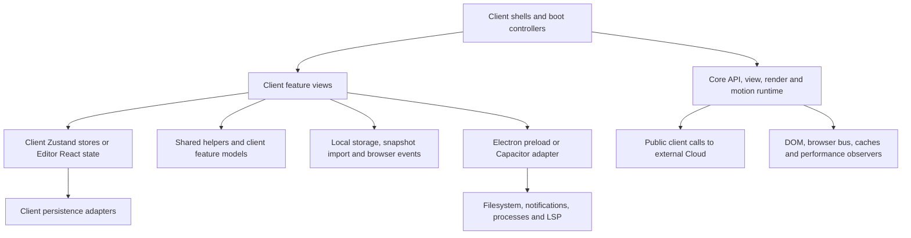

# Current architecture recovered from implementation

Baseline: `d39cfa2`. **Observed** means directly traced in source or a check; **reproduced** means exercised in this audit's synthetic fixture; **risk** means a plausible failure requiring a real lifecycle/device test. Neither historical plans nor a passing source-pattern gate establish runtime behavior.

## The implemented dependency shape

This is not `clients → shared domain → persistence adapters`. Most domain mutation authority is client-owned. Feature views also serialize data and coordinate several stores. Core has no static import back into the four clients, but some of its public model/schema code is not the model used by those clients.

## Main and Mobile flow

Both React entries mount their `App.tsx`. Shells build a runtime, fetch catalog/layout/release metadata, calculate available views, validate navigation, preload chunks, configure render/motion and apply theme/accessibility values. Actual feature rendering is delegated to `app/*ViewHost.tsx`; lazy components come from `viewPreload.tsx`. Cached views use `display: none`, which hides DOM without stopping effects.

Main's registry adds icons, order, preload priority, heavy-view markers and development-only views to core metadata. Mobile maintains its own config, sidebar and toolbar/navigation lists. Core view access also contains a separate local-free allowlist. Thus metadata, mount capability, availability and authorization are related but distinct owners.

Main's `App.tsx:717` onward explicitly supports safe local startup after recoverable/bootstrap anonymous-auth errors. That contradicts the strict hosted-only introduction in `Nexus Main/docs/ARCHITECTURE.md`. Mobile has its own fallback branch and partial-bundle handling; it reports `appVersion: '5.0.0'` at `App.tsx:466` while its manifest is `6.0.0`. Do not unify these branches without defining policy fixtures.

Notes, archived code, tasks, reminders, folders and activities live in each client's `store/appStore.ts`. Canvas and workspace membership use separate stores. Theme owns appearance plus layout, motion, editor and accessibility preferences. Main's terminal store is an application-command dispatcher with cross-store access, not an operating-system terminal. Calendar in Main is a projection/editor over tasks and reminders; there is no separate canonical calendar database. Flux is a local activity/queue projection and command surface, not a verified Cloud automation engine.

File handoff is reachable through `views/files/useWorkspaceSync.ts` on Main and `FilesView.tsx` on Mobile. Main's separate `hooks/useWorkspaceRuntimeSync.ts` is currently unreferenced by application imports. Its existence does not establish boot hydration or continuous disk autosync. Main Files exposes a persisted Auto-Sync toggle despite this missing caller.

## Code clients

Desktop `App.jsx` delegates boot/auth to `app/useNexusCodeBoot.js`. `pages/Editor.jsx` owns workbench state, file arrays, tabs, active buffer references, autosave, workspace selection, commands, layout and settings. `components/editor/CodeEditor.jsx` adapts CodeMirror to a real `ide/editor/editorEngine.js` and LSP service/transport. Electron services separate Git, GitHub, token storage, LSP processes, process execution and navigation policy. These are substantial assets.

Code Mobile independently coordinates the same broad workbench concepts in `pages/Editor.jsx`, but uses Monaco and `lib/nativeFS.js` (Capacitor Documents/Data paths). Its terminal is deliberately simulated (`Terminal.jsx:307`); its Debug panel explicitly declares simulation/preview. Desktop Debug also manages sample variables and timer-driven frame/step state; no debug-adapter transport was found in that component. A visible IDE panel must not be assumed to implement the desktop service capability suggested by its label.

Both Code clients retain an obsolete `api/base44Client.js` compatibility stub and unused auth/provider scaffolding. The actual account owner is the boot/session code, not `lib/AuthContext.jsx`. Local code files use segmented localStorage through `pages/editor/editorShared.jsx`; desktop workspace files instead go through `window.electronAPI`. These modes require separate recovery guarantees.

## Shared foundation

`@nexus/core` is a real but mixed shared client layer: render/motion policy, view manifests/resolvers, API/runtime lifecycle, quick capture, today projections, note analysis/templates, reminder templates, code analysis/execution helpers, canvas renderers, settings parsers and UI primitives. `src/runtime.ts` applies DOM styling, whereas `src/api/runtime.ts` creates the API/connection/performance lifecycle. They are different runtimes.

`liveSync.ts` prepares view availability/layout metadata. `api/connection/manager.ts` uses BroadcastChannel and storage events for a browser-origin event bus. Neither is evidence of reliable cross-device domain synchronization. Root development ports separate browser origins; independent Electron/Capacitor containers also do not magically share web storage. The private Cloud backend is outside this audit.

## Historical explanation, not historical authority

| Commit | Relevant observation | Meaning for migration |
| --- | --- | --- |
| `7657464`, 2026-03-19 | Bootstrap ecosystem and Main/Mobile core connection | Shared foundation was introduced into existing client shapes |
| `ab576c2`, 2026-04-10 | Split oversized core files | Existing boundaries are partly the result of earlier extraction work |
| `61fc7b0`, 2026-04-15 | Broad release pass; appears in hook-call history | File presence and past use do not prove present wiring |
| `725e19a`, 2026-05-06 | Fix stale delayed autosync timer | The retained hook has known lifecycle history; reactivation needs tests |
| `b819a29`, 2026-06-20 | Canvas/UI workflow work and shared model history | Shared canvas model coexists with older client stores |
| `6ebbdba`, 2026-06-27; July Code commits | LSP bridge and IDE model/polish evolution | Preserve engine/protocol/model boundaries; do not restart the historical recode plan |
| `9e831a4`, 2026-09-18 | Main icons moved from `assets/icons` to `icons`; scripts changed | Explains stale verifier path and installer-name assumptions |
| `d39cfa2`, 2026-09-22 | Replaced Main/Mobile embedded editors with archive routes | Old editor helpers/docs are legacy evidence, not the intended current product |

History was inspected with scoped `git log`, `-S useWorkspaceRuntimeSync` and `git show --stat`; causal intent beyond commit messages and diffs is not inferred.

## Evidence index

These anchors support the detailed reports. Line numbers refer to the audit baseline; symbols are the more durable lookup keys.

| ID | Concrete source and fact |
| --- | --- |
| E01 | Four app `package.json`/Vite/TS configs; root `package.json`; source aliases and divergent verification/build paths |
| E02 | Main `src/App.tsx:344,591,717`; Mobile `src/App.tsx:448,555`; boot, session, runtime and fallback coordination |
| E03 | Core `src/api/control/client/view-access.ts:15,128,148`; per-client free-view policy, cache, auth and explicit denial handling |
| E04 | Main `src/app/mainViewRegistry.ts`, `mainViewHost.tsx:218,275`, `NexusV6ViewShell.tsx:170`; metadata, command filtering, cached view visibility |
| E05 | Main/Mobile `src/store/appStore.ts`, `workspaceStore.ts`; CRUD, persisted domain/UI state and independent membership arrays |
| E06 | Main/Mobile `src/store/persistence/indexedDbStorage.ts:104,215,260,270`; early legacy deletion and failed-batch loss |
| E07 | Main/Mobile `src/store/persistence/storeManager.ts:70,82,130,221`; segmented localStorage, swallowed write errors and teardown flushing |
| E08 | Both Code clients `src/pages/editor/editorShared.jsx`, symbols `loadFilesFromStorage`/`saveFilesToStorage`; cache/write migration defect |
| E09 | Main `src/views/files/useWorkspaceSync.ts:153,169,449`; disk import/export directly mutates stores; `hooks/useWorkspaceRuntimeSync.ts:75` has no caller |
| E10 | Main `src/app/workspaceBackup.ts`, `parseWorkspaceBackupSnapshot`; `SettingsBackupRestorePanel.tsx:192`; shallow validation and sequential five-store restore |
| E11 | Mobile `src/views/FilesView.tsx:215,299,531`; version-1 handoff, merge/replace and checkpoint orchestration |
| E12 | Main `src/views/notes/useNotesDraftState.ts:4,71,99`; delayed drafts, idle flush and saved UI; Main `NotesView.tsx:902` onward creates cross-domain items |
| E13 | Main `src/views/reminders/reminderHelpers.ts:109`; Mobile `RemindersView.tsx:178` and `lib/mobileReminderService.ts`; view-mounted checkers and native scheduling caches |
| E14 | Main/Mobile `src/store/canvasStore.ts:8`; core `canvas/model/canvasTypes.ts`; separate flat versus `pm` planning schemas |
| E15 | Main `src/views/CalendarView.tsx`, `calendar/icsImport.ts`; task/reminder projection, date mutation and ICS mapping |
| E16 | Main/Mobile `src/views/FluxView.tsx`; local derived queue/activity and quick-action mutation; no domain-sync engine |
| E17 | Main/Mobile `src/views/CodeView.tsx:7`; read/export archive; core `views.ts:206` still declares editor-like actions |
| E18 | Main/Mobile `src/store/themeStore.ts`, `views/settings/settingsBridge.ts`; active theme authority versus shared settings snapshot schema |
| E19 | Core `settings/useSettingsStore.ts:64`; exported singleton/non-subscribing hook, no client consumer found |
| E20 | Core `render/renderCoordinator.ts`, `renderInvariants.ts`, `runtimeBridge.ts`, `motion/motionEngine.ts`; client render adapters delegate to them |
| E21 | Code `src/pages/Editor.jsx:141,355,1675`; buffers/files/tabs/autosave; `ide/editor/editorEngine.js` contract `0.2.0`; `ide/lsp/*` |
| E22 | Code Mobile `src/lib/nativeFS.js`; `components/editor/CodeEditor.jsx:2`, `Terminal.jsx:307`, `DebugPanel.jsx`; native IO and capability differences |
| E23 | Main `electron-main.cjs`, root `preload.cjs`, `electron/ipc-handlers.cjs`; Code `electron/{main,preload}.cjs`, `electron/services/*` |
| E24 | Main `src/index.css`; PostCSS parsed 2,610 rules and 2,627 important declarations, repeated selectors in identical contexts |
| E25 | `tools/verify-nexus-core.mjs`, `verify-ecosystem.mjs`; `.github/workflows/contract-parity-e2e.yml`; pattern checks versus behavioral testing |
| E26 | Core `test/devtools-policy.test.mjs:1` imports absent helper and is omitted by package test script; Code-Mobile Debug test also omitted from its package script |
| E27 | Code `src/testing/ideCoreSmoke.mjs`, its runner and `testing/README.md`; 52 model/contract scenarios executed successfully |
| E28 | Core `api/runtime.ts`, `api/connection/manager.ts`, `liveSync.ts`; external API lifecycle versus local-origin events, not persisted domain replication |
| E29 | `docs/PARITY_MATRIX.md`, Main architecture/README, Mobile README, July recode plan; concrete drift catalog in report 10 |
| E30 | Mobile `package.json`, `android/capacitor.settings.gradle`, `android/app/capacitor.build.gradle`, `ios/App/Podfile`; Local Notifications is declared and linked in tracked native configuration, but device permission/delivery behavior was not executed |
| E31 | Main `app/mainAppConfig.ts:3` → `app/viewPreload.tsx:24` → `views/DevToolsView.tsx:24` → `views/devtools/ReleaseHealthDashboard.tsx:21-22` → configuration/loader; dependency cycle includes a lazy import, not a demonstrated synchronous initialization defect |

## Limits of recovery

Import inventory used TypeScript AST import/export/literal dynamic-import/require edges, including type imports and barrel exports. It does not prove that every reachable export executes, and it misses non-import references such as Worker URLs, CSS, config-loaded entries or external consumers. Unreached workers and declaration files are not dead-code findings. No cyclic-runtime claim is made from type-only cycles. Native behavior, visual fidelity, real user-data prevalence and live Cloud contracts remain unverified.
