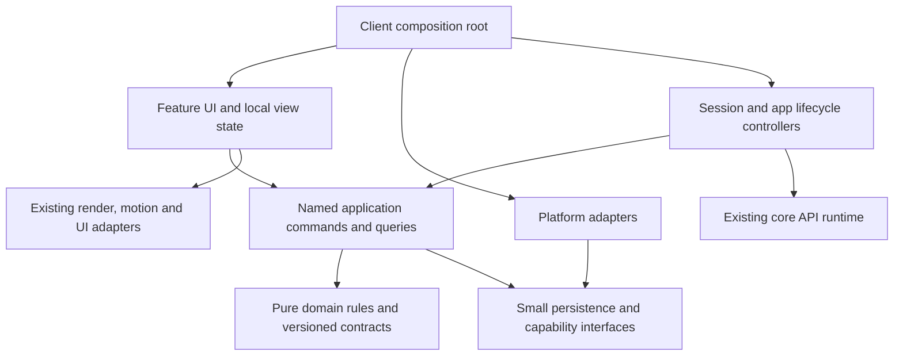

# Incremental target architecture

This is a proposal derived from the recovered implementation, not an implementation mandate. Preserve the four clients, their platform-specific experiences, existing data, core render/motion infrastructure and IDE engine. Introduce boundaries where competing owners and durability failures were observed; do not impose a new framework across the repository.

## Direction of dependencies



Arrows denote compile-time use/implementation relationships. Runtime composition supplies concrete adapters to commands; domain rules must not import the client root, React stores, DOM, Electron or Capacitor. A few explicit factory arguments are sufficient. No service container, microservices, event sourcing or CQRS is justified.

During migration, existing Zustand actions and Editor APIs remain compatibility facades. UI may temporarily call both old actions and new named use cases, but a given operation has one canonical writer. The first extraction can stay inside a client; code moves into core only after two consumers share a proven contract.

## Ownership decisions to make explicit

| Concept | Target canonical owner | UI/derived owner | Persistence / external boundary |
| --- | --- | --- | --- |
| Notes/tasks/reminders/code archive/folders | Domain collection state exposed through current store facade and named operations | Feature filters, selection and projections; Calendar/Flux remain projections | Versioned repository adapter; stable IDs and current read formats |
| Note/editor draft | One edit session identified by entity ID and external revision | Selection, focus, transient undo/IME state remain editor-local | Commit updates domain revision; durable acknowledgment tracked separately |
| Canvas graph/planning | One agreed lossless serialized contract, client command facade | Gestures/viewport/selection/history with explicitly chosen session durability | Repository + bidirectional version adapters; flat/`pm` decision precedes consolidation |
| Workspace membership | Workspace service validates membership references according to explicit orphan policy | Active view/sidebar selection | Workspace repository; snapshot coordinator applies cross-domain state |
| File workspace/handoff/backup | Snapshot application service owns parse/validate/prepare/apply/recover | UI preview, conflicts, user choice, progress | Browser IDB/download or filesystem adapter; a recoverable operation, not unrelated setters |
| Theme/settings | Existing client settings owner, refined into sections | Derived render/motion profile and CSS tokens | Core versioned transfer schema; preserve client-specific fields explicitly |
| Auth/session | Client session controller; external server remains account authority | Login form and progress/error rendering | Existing sessionStorage/expiry/logout contract; capability policy supplied explicitly |
| View availability/access | Registered capabilities intersected with validated availability/policy | Navigation/mounted cache and layout | Shared resolver contract; client policy configuration, explicit deny behavior preserved |
| Reminder delivery | App-level service with explicit start/stop/reconcile lifecycle | Reminder screen shows/edit state only | Web/Electron/Capacitor notification adapter; device acceptance criteria required |
| Code workbench | File-ID-bound controller owns buffers/tabs/pending saves | CodeMirror or Monaco adapter and panel UI | Local-file or native-workspace repository chosen once per mode |
| LSP documents | Existing engine owns protocol versions/diagnostics for a buffer session | CodeEditor consumes events | Transport/service boundary; never a second disk-save authority |
| Terminal/preview | Separate domain-command, real process and simulation services | Shared-looking UI may remain different | Explicit capabilities; do not pretend these three contracts are interchangeable |
| Cloud/runtime | Existing API lifecycle owns requests/caches/subscriptions | Shell renders status and supplied metadata | Public client contract only; no invented remote domain sync |

These target owners address the actual competing paths in [04](04-state-ownership-audit.md). They do not require merging every domain into a single global store or database.

## Boundaries with the highest value

### Storage and durability

Introduce a small engine behind existing `PersistStorage` and local-file APIs. Define readiness, queued revision, committed revision and structured errors. “Saved” must have a documented meaning: a domain commit and a durable commit are different states. Do not simply change the visible label without preserving current UX through a deliberate product decision.

The engine must retain a complete recoverable representation through failed writes/migrations. Use IndexedDB transactions where already available and staged file replacement where supported. For localStorage, write a complete generation then select it, retaining the prior valid generation; choose the exact format only after quota/compatibility fixtures. There must be one writer per selected format. An unload hook is best effort, not a durability guarantee. [05,15]

### Snapshot application

Provide one `prepareSnapshot` operation returning normalized data, schema/referential errors, conflicts and the proposed changes. An `applyPreparedSnapshot` operation should establish a recovery point, prevent draft writers from racing the transition, apply a validated generation and report a durable outcome. Method names are illustrative; retain existing public import/export formats initially.

Cross-store JS setters cannot become a true multi-backend transaction just by being wrapped in a function. Use a selected snapshot generation/recovery marker and idempotent recovery where needed; distinguish in-memory atomic visibility from durable storage recovery. Avoid a cross-platform distributed transaction framework. Characterize current empty-array, merge and partial-domain import behavior before choosing differences.

### Edit sessions and commands

Capture file/note ID and revision when scheduling work; never select the save target from whichever tab happens to be active later. Define what happens when external restore changes that revision: flush, reject, rebase or replace must be an explicit product policy. Keep cursor/IME/undo behavior inside the editor adapter.

Extract concrete cross-domain operations such as “create tasks from note,” “link task to canvas node” and “apply workspace snapshot.” They return created IDs/results rather than forcing the view to compare store arrays. Reconcile deletion references through explicit policy; do not silently cascade-delete valuable linked data.

### Boot and capability lifecycle

Separate session acquisition, metadata bootstrap, policy calculation and runtime start/stop from JSX. Model legal phases and cancellation/disposal rather than adding more flags. Preserve Main's actual local fallback and Code's strict workbench gate until a product decision changes them. Keep explicit 401/403 denials and development-only diagnostic policy.

Local registration, server availability and permission are different facts. Give each one a named input and test the intersection. A capability must include a real handler or an explicit unavailable/simulation state; a manifest entry alone must not advertise execution.

## Shared package evolution

Keep `@nexus/core` as the existing package initially. Document narrow conceptual surfaces for `render`, `motion`, `views`, `api`, pure `notes`/`reminders` helpers and versioned domain/transfer contracts. Add public subpaths gradually if needed, retaining root exports for compatibility until consumers migrate.

Make core more authoritative for data-format adapters, command IDs, capture inputs/results, view contract validation and shared parsing. Do not move the whole App, Notes view, device permission flow, CodeMirror/Monaco instance or native file picker into core to improve a sharing metric.

Separate optional React/browser modules from pure domain contracts. Retire or rename the unused shared settings singleton only after consumer review; the target must not instantiate it alongside the real client theme store. Shared Canvas types should either become the adopted serialized contract through adapters or be clearly labeled internal/experimental. Do not keep parallel “canonical” schemas.

Desktop Code's editor/LSP/models stay where they are until a real second compatible consumer exists. Monaco on Code Mobile is not evidence that both clients can share a concrete editor implementation. Browser/Electron/Capacitor adapters should normalize error/capability contracts while keeping the platform mechanisms local.

## Predictable module shape

A prospective feature can use the following shape, introduced only when that feature is changed:

```text
feature/
  ARCHITECTURE.md        # owners, invariants, consumers, checks
  contract.ts           # public command/query and data types
  model.ts              # pure rules and transformations
  commands.ts           # bounded orchestration
  controller.ts         # session/lifecycle, if actually needed
  adapters/             # IO or existing-store compatibility
  ui/                   # React views and editor adapters
  tests/                # behavior and compatibility fixtures
```

Do not create empty folders, move the repository wholesale, or split declarative tables only to meet a line cap. Each file should have one comprehensible owner/lifecycle. As a review heuristic, a controller around 300–500 lines deserves a scope check; the desired outcome is local reasoning, not an arbitrary maximum. Existing larger modules can shrink gradually behind their exported interfaces.

## Agent comprehension and acceptance

An agent task should change one architectural objective, usually one owner/contract and its immediate adapters/tests. Its briefing must identify canonical state, schema/storage keys, compatibility behavior, changed consumers, verification and rollback. If safe work requires coordinating several unrelated owners, split the task at the contract boundary before editing.

Target success means a new agent can answer who owns a note draft, who can replace a workspace, what “saved” guarantees, what a platform can execute and which tests protect it by reading a short local contract plus its implementation. Reducing LOC or copying everything into core is not an acceptance criterion. The detailed task rules are in [13](13-agent-development-rules.md), and adoption order/rollback are in [12](12-migration-roadmap.md).
