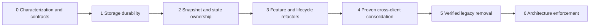

# Migration roadmap

This roadmap is a recommendation. The audit made documentation changes only; each implementation wave requires a later authorized task. Preserve behavior and stored data over internal neatness. Wave numbers express dependency order, not release dates or effort estimates.

## Sequence and controlling risks

Compatibility boundaries precede implementation swaps. Legacy and new implementations may coexist in source, but only one may write a particular data generation. Shadow comparison is read-only. A rollback must preserve edits made since migration; returning to an old binary alone is not a data rollback.

## Wave 0 — Characterization, evidence and contracts

**Objective:** establish reliable, reviewable safety criteria before refactoring high-risk systems.

**Scope:** synthetic legacy/current storage fixtures for Main/Mobile and both Code clients; reproduce restart/failure cases from [05](05-persistence-audit.md); capture import/backup merge and empty-array behavior, note/editor draft switching and boot/access policy. Record authoritative IDs/schema keys, currently active consumers and platform capabilities. In separate bounded verification changes, repair the missing policy-test helper/wiring, stale icon verifier and test discovery; decide intended Code JS/typecheck scope without suppressing defects indiscriminately.

**Dependencies:** baseline `d39cfa2` or a freshly reconciled HEAD; existing successful checks in [09](09-test-protection-plan.md); sanitized fixtures. Product confirmation is needed before choosing new offline behavior, restoring Auto-Sync, changing Canvas formats or broadening reminder delivery. Pure failure characterization does not need those choices.

**Expected risk:** low to production if tests/contracts remain isolated; moderate risk of creating misleading tests that assert source spelling instead of behavior.

**Verification gates:** demonstrate both Code legacy migrations failing the preservation oracle; simulate IDB failure without deleting the only recoverable value; specify expected post-fix behavior. Record fixture outputs for existing correct v2/IDB data. Distinguish policy-test load failure from assertion failure. Establish explicit public-only test commands and a diagnostic baseline for Code JS. No change to product code hidden inside a test cleanup.

**Rollback:** revert test/gate changes independently; no user-data migration. Retain the original failing fixture as evidence. If a gate proves incorrectly scoped, correct its scope rather than claiming a product regression.

**Exit artifact:** storage and snapshot contract notes, fixture corpus, command/result ledger and bounded Wave 1 tasks. This is the recommended first implementation authorization.

## Wave 1 — Replace unsafe persistence internals

**Objective:** preserve recoverable bytes and expose real commit/failure semantics behind current storage APIs.

**Scope:** only the two D candidates in [15](15-recode-candidates.md): Main/Mobile IndexedDB/fallback engine and Code/Code-Mobile segmented local-file repository. Implement one family at a time; initially keep callers, keys/read formats, IDs and client behavior stable. Use a narrow adapter facade and retain old readers/data. Correct the reproduced content-loss and failed-batch defects explicitly.

**Dependencies:** Wave 0 storage corpus and failure injection; decision on oldest supported formats, available quota and rollback retention. Inspect dependencies at the implementation HEAD; do not copy this audit's assumptions blindly.

**Expected risk:** very high data risk despite small source scope. Primary risks are unsupported old profiles, switching writers too early, quota consumed by retained copies, and UI falsely treating enqueue as durable commit.

**Verification gates:** legacy→new→fresh-process roundtrip preserves content/IDs; existing current data unchanged; all interruption points retain either old or new complete generation. Exercise open/transaction/quota failure and fallback recovery; successful acknowledgment corresponds to the specified durability level. Run contract fixtures against both clients, real-browser reload tests, then limited native-container upgrade tests. Verify ordinary edit/delete/close workflows and bounded write performance. Never test migrations on the only copy of a user's data.

**Rollback:** select the previously valid generation/read path while retaining the new generation for recovery. Preserve all post-cutover edits through an explicit export/backward projection or forward recovery tool before reverting an incompatible reader. Do not dual-write through the known-lossy old migration. Delay destructive cleanup until supported release/rollback window is defined and passed.

**Exit artifact:** proven adapters and migration evidence. Shared extraction can wait; source deduplication is not the gate for durability.

## Wave 2 — Consolidate snapshot, draft and domain ownership

**Objective:** one explicit application path for multi-store changes and one draft owner per edited entity.

**Scope:** validated `prepare/apply` snapshot facade for Main Files/backup and Mobile handoff; recovery points and durable outcome reporting. Preserve current format readers and capture intentional differences. Introduce revision-aware note/editor draft sessions and ID-bound pending saves. Place cross-domain create/link/delete operations behind existing store-compatible commands. Agree on referential policy; do not silently cascade-delete linked data. Establish lossless Canvas compatibility adapters before changing storage representation.

**Dependencies:** Wave 1 acknowledgment/read/recovery contracts; characterization of current merge/empty-array behavior; agreed supported schemas and Canvas field/status policy.

**Expected risk:** high. Same-ID restores, active drafts, dangling memberships, partial domain imports and cross-client unknown fields can lose valid work if normalized prematurely.

**Verification gates:** malformed backup rejected without mutating stores; checksum meaning tested; unknown/future fields handled non-destructively; complete import recovery after interruption; no stale draft overwrites restored content. Cross-domain commands return stable IDs and preserve links. Main↔Mobile↔Main snapshots retain agreed fields/statuses. UI preview counts/errors correspond to exactly what is applied. Existing undo/dirty-close behavior stays unchanged unless explicitly approved.

**Rollback:** legacy facade remains selectable for unmodified operations; retain pre-apply and post-apply generations. Disable the new import/application path if contracts diverge, recover from the validated snapshot, and keep drafts/exports available. Do not revert to an older destructive storage layer.

## Wave 3 — Refactor lifecycle and feature controllers

**Objective:** reduce unrelated lifecycle coordination while preserving established feature UI.

**Scope:** client boot/session controllers; app-owned reminder delivery lifecycle; Notes/Tasks/Calendar/Canvas/Flux named operations and selectors; Code workbench edit-session controller. Keep the existing core render/motion and desktop engine/LSP/service interfaces. Separate real terminal execution, application commands and simulation capabilities. Extract one controller/use case per task, not all clients in one change.

**Dependencies:** Wave 2 state/import/draft contracts and product decisions on access/reminder/Auto-Sync policy. Auto-Sync reactivation is an explicit feature task, not an incidental hook cleanup. Current manual handoff must stay usable throughout.

**Expected risk:** high for auth, reminders and editor event ordering; medium for pure selectors/commands.

**Verification gates:** boot matrix and explicit denial behavior preserved; runtime starts/stops once per intended lifetime; hidden/never-mounted views behave as specified. Reminder dedupe/reschedule tested with mock service then physical devices. Editor tab switch/rename/workspace change cannot redirect pending saves. Calendar timezone/ICS and Canvas gesture/history smoke pass. Run focused visual/interaction comparisons, not merely typechecks.

**Rollback:** keep previous controller behind the same interface; switch a whole lifecycle owner, never start both schedulers/runtimes. Preserve stored formats and latest data. Roll back one feature at a time and rerun its behavioral corpus. If a public behavior intentionally changed, document whether rollback restores old behavior or needs compatibility handling.

## Wave 4 — Consolidate proven cross-client contracts and design rules

**Objective:** remove accidental duplication without flattening necessary platform differences.

**Scope:** consolidate proven storage/serialization adapters, pure capture/task/reminder rules and schema conversions; narrow core exports and document optional React/browser entry surfaces. Share command/capability validation and policy configuration where equivalent. Align settings transfer while preserving client-specific sections. Extract Main CSS incrementally with exact cascade/visual protection. Leave CodeMirror/Monaco, device layout, native IO and permission flows in their adapters.

**Dependencies:** two real consumers passing the same behavior/format tests; accepted Canvas mapping; sufficient visual baselines. Do not move unproven code to core solely because two filenames match.

**Expected risk:** medium-high. Root-barrel changes can alter module initialization/dependency resolution; theme/CSS changes can affect every view.

**Verification gates:** old root imports stay compatible until migration; no core-to-client dependency; pure schema imports do not instantiate DOM/settings state; both consumer suites pass. Settings roundtrip preserves defined local options. CSS screenshots/computed styles pass across themes/viewports/reduced motion. React resolution and bundle/interaction budgets stay within documented thresholds.

**Rollback:** retain compatibility exports and client adapter wrappers; revert consumer batches independently. Keep old stylesheet order available until visual acceptance. No rollback requires restoring a discarded data representation.

## Wave 5 — Remove only verified legacy

**Objective:** eliminate obsolete implementation choices after consumers and data no longer depend on them.

**Scope:** candidates in [08](08-complexity-hotspots.md), including alternate Electron TS implementations, unused embedded-editor helpers, auth scaffolds and the dormant Auto-Sync hook if product scope retires it. Also remove superseded storage code only after its compatibility window. Preserve the active Code archive, data readers still needed for supported upgrades, and historical evidence.

**Dependencies:** reachability inventory including imports, dynamic URLs, config/scripts/native entries and external/public consumers; accepted replacement and rollback strategy; supported upgrade policy. Each candidate gets its own evidence, not a directory-wide deletion assumption.

**Expected risk:** medium, rising to high for packaging entries and migration readers.

**Verification gates:** no supported caller/config/package needs the module; tests/builds/package entry smoke pass; retained legacy profile upgrades remain readable; archive exports unchanged; docs distinguish removed features from internal removal. A missing static importer alone does not pass this gate.

**Rollback:** ordinary code reversion is sufficient only for unused source. Preserve release snapshots and data readers for format cleanup; if deleting old stored generations, require a separately reviewed retention/recovery decision. No blind cleanup of user storage.

## Wave 6 — Make boundaries durable

**Objective:** keep architecture understandable and prevent recurrence of multiple owners/unchecked migrations.

**Scope:** lightweight import-boundary checks, full test discovery, configured JS/TS checking with explicit scope, schema compatibility fixtures in CI, lifecycle/persistence regression checks, canonical local docs and capability matrices. Stabilize public-only installation/build commands; separately mark optional sibling/native/full-release lanes. Apply [13](13-agent-development-rules.md) to future work.

**Dependencies:** earlier boundaries are actually adopted; ownership and exceptions are documented; CI environments and performance budgets chosen explicitly.

**Expected risk:** low runtime risk, moderate developer-flow risk if noisy gates obstruct unrelated fixes.

**Verification gates:** fresh public checkout has a reproducible narrow validation lane; every intended test is discovered; a deliberate forbidden import/unsupported schema fixture is caught; no blanket suppression hides existing debt. Documentation cites current owners and commands. Native/visual checks remain honestly separate from static checks.

**Rollback:** adjust or disable an incorrectly scoped gate with a tracked rationale; preserve useful tests and existing runtime. Do not loosen safety invariants simply to make an unrelated release green.

## Work packet and stop conditions

Every wave should be several bounded work packets: problem/evidence, changed owner, invariant, compatibility fixture, implementation boundary, checks, rollback. No packet should combine storage-format change, product feature redesign, CSS cleanup and dependency upgrade.

Stop a migration rollout when supported fixtures lose fields/content, old/new disagree without an approved behavior change, storage errors cannot be surfaced, rollback loses post-cutover edits, or a required native behavior remains unverified. Continue independent analysis/protection work while the missing decision is resolved. This is a staged modernization plan, not approval for a big-bang rewrite.
