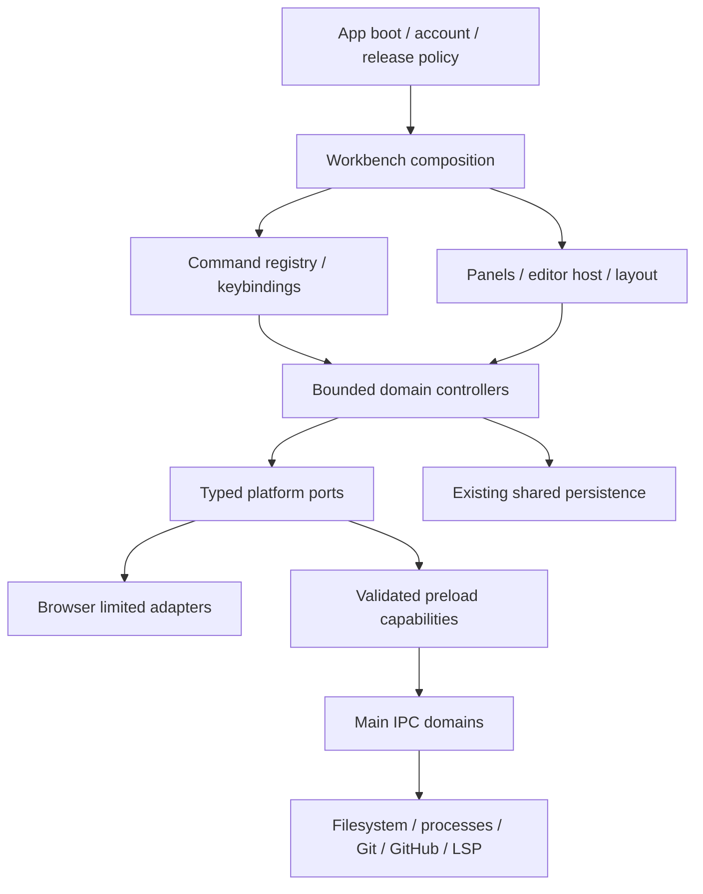

# Target architecture and ownership

Decision: strangler migration around existing contracts. Folder names below express ownership; move code only with a bounded behavior migration. Existing wrappers remain adapters until consumers and tests have moved. Keep shared persistence in `@nexus/core`; do not create another save queue or file writer inside V2.

## Boundaries

| Boundary | Target modules | Current migration seam |
| --- | --- | --- |
| App | `app/boot`, account, routing | Preserve `App`, boot hook and account helpers; isolate later only where coupling is demonstrated |
| Workbench | composition, layout, tabs, commands, navigation, status | Existing dock/focus models and panel chrome; peel controllers from Editor |
| Documents/editor | document facade, CodeMirror host, providers, diagnostics, editor commands | Existing editor engine/URI/protocol/feature models; wrap revision-bound persistence |
| Workspace | root, tree cache, filesystem events, search, recents | Existing file-tree model and injected filesystem port; eliminate random component bridge access |
| Runner/terminal | process sessions, task discovery, typed bridge, UI | Preserve real process path; distinct PTY port only after ADR acceptance |
| SCM | local Git state/actions; remote GitHub domains | Existing argv-based Git service, GitHub/auth/token owners |
| Debug | session, DAP transport, adapter resolution, UI | New runtime only; remove production synthetic state |
| Extensions | manifest registry, allowed contributions, UI | Preserve validated declarative data; no renderer executable host |
| Settings/UI | setting schema/persistence; semantic tokens/primitives | Existing catalog/defaults/theme resolver behind a compatible schema |
| Platform | interfaces/result/error/event schemas | Introduce strict TS at the renderer/preload/main seam |
| Electron | domain IPC registration, services, security helpers | Split registration after parity tests; main stays lifecycle composition |

## Canonical owners

| State | Canonical owner | Rules |
| --- | --- | --- |
| Workspace roots, directory entries, lazy children, recents | Workspace controller | Paths are native authority, canonical validation is main-owned; stable IDs preserved |
| File content, draft revision, saved revision, save/error state | Document facade over existing `useEditorPersistence` / `documentSaveQueue` | One writer; no clean acknowledgment for a different revision or document |
| CodeMirror buffer and selection/undo | Per-document editor session | Buffer view of document; tab does not own content; switching commits draft by identity |
| Open/active/closed tabs | Workbench tab state | Tab IDs refer to documents; closing cannot silently discard pending failures |
| Diagnostics per URI/version/source | Diagnostics service | Editor decorations, Problems and status derive from same normalized collection |
| LSP sessions and capabilities | Language service, per workspace/language lifecycle | Editor views attach/detach documents; do not restart servers for appearance changes |
| Layout, panel visibility/focus and sizes | Workbench layout state | Preserve existing normalized docking model and persisted readers |
| Runner / PTY sessions | Terminal domain | Process-owned status, bounded output, ownership and teardown; UI is a subscriber |
| Git repo state/status/diff/mutations | Local SCM domain | Repository generation/cancellation; never infer remote GitHub state from local files |
| GitHub auth and remote entities | GitHub auth/main services + remote query state | Secret stays main-owned; domain-specific services share validated request client |
| Breakpoints and debug sessions | Debug domain | URI/position identity; adapter responses own verified runtime state |
| Settings and overrides | Settings service | Schema validation, migration, default merge and acknowledged persistence |
| Workbench/syntax theme | Theme resolver | Separate semantic colors/syntax/effects; layout remains independent |
| Account/release/access | Existing app policy | SessionStorage-based Nexus token behavior, legacy localStorage removal and fail-closed access retained |

No single global store is necessary. Start with focused React hooks/controllers and stable ports; use external subscription stores only when measurements or lifecycle independence require them. Model ownership is not permission to duplicate current state in parallel.

## Stable contracts

`PlatformResult<T>` is a discriminated result: `{ok:true,data:T}` or `{ok:false,error:{code,message,retryable,diagnosticId?}}`. Detailed native errors are scrubbed and kept outside ordinary copy. Existing filesystem throws/primitives and Git/GitHub/LSP result objects need **adapters**, not a breaking preload change. Capability groups: window, workspace, runner, git, github, lsp. Unsupported browser operations return structured unavailable results, never success samples.

Events include domain/session/document identity, monotonically increasing revision/generation and a disposer. No raw IPC object crosses into UI. Avoid adding global CustomEvents; adapt existing events temporarily and remove them when every consumer uses explicit commands. Native sender and payload validation must be applied at main as well as preload.

`CommandDefinition` includes stable ID, title, category, default platform keybinding, availability predicate, handler and optional icon/context. Existing IDs (`new-file`, `open-settings`, `editor.save`, etc.) need a compatibility map. One registry owns dispatch and availability; menus/palette/keybindings consume it. This is an evolution of the existing command catalogs, not a second catalog.

Settings descriptors include key/type/default/category/label/description/validation/restart requirement. Preserve existing keys and unknown persisted values during migration. Keep desktop Code schemas local unless another client proves identical semantics. Strong TS contracts first; preserve JSX implementations through checked interfaces. Use a strict, noEmit boundary config; do not disable the failing JS gate or mass-add `any`/`@ts-ignore`.

## Document/save/external-change model

Document identity separates URI, native path, display name, language, content, saved version, dirty/save state, encoding/EOL, read-only state, external revision and LSP version. The current filesystem port is UTF-8; encoding selection is not implemented. Retain exact bytes/line-ending behavior within that limitation.

Every write captures intended revision. On acknowledgment, update the matching saved revision; newer edits stay dirty. Rename/delete/workspace replacement serialize behind the existing mutation guard. Native `writeFile` acknowledgment currently proves completion of that API, not atomic replacement, fsync or power-loss durability. Native atomic writes and installed restart/crash tests need a separate bounded packet before reliability claims expand.

External clean changes can reload with notification; dirty changes become a conflict and require a choice. No watcher exists today. When introduced, main owns workspace-scoped watcher lifecycle and the document facade arbitrates conflicts, including self-writes and rename identity. Search replacement and LSP multi-file edits must route through this same document/workspace authority.

## Migration discipline

For each extraction: inspect current tests and every consumer, define current/target semantics, add behavioral protection, introduce a compatible port, migrate one caller set, run gates, update status/checkpoint and stop. Delete old implementation only after single ownership and regression/compatibility evidence. Consult [ADRs](decisions/0001-codemirror.md), [roadmap](04-migration-roadmap.md) and [test strategy](09-test-strategy.md).
